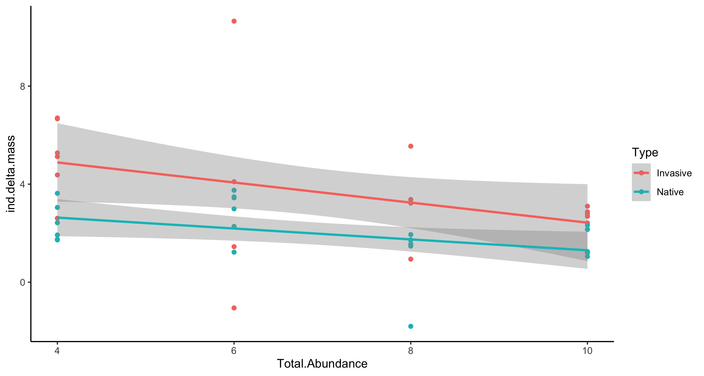
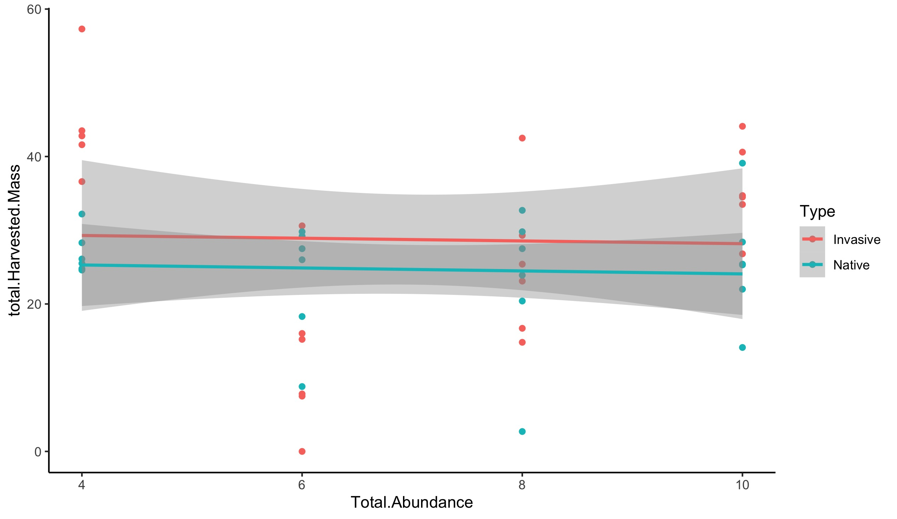
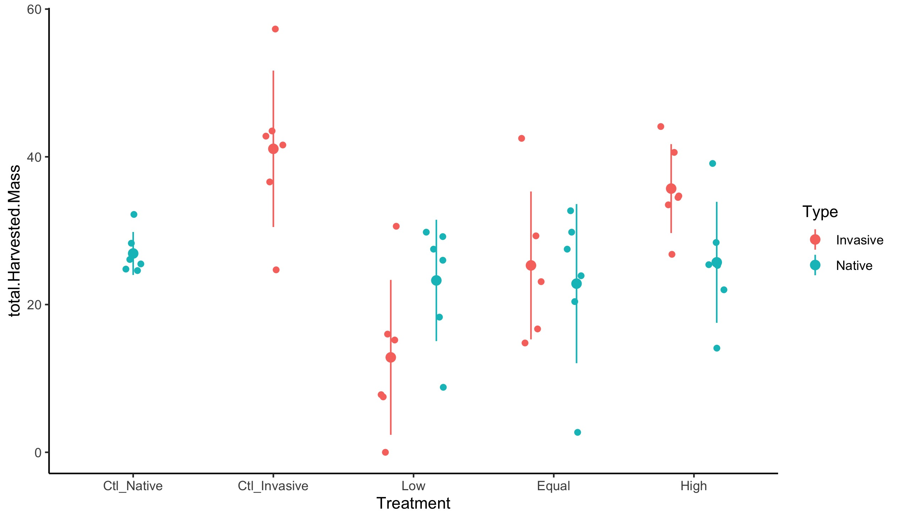
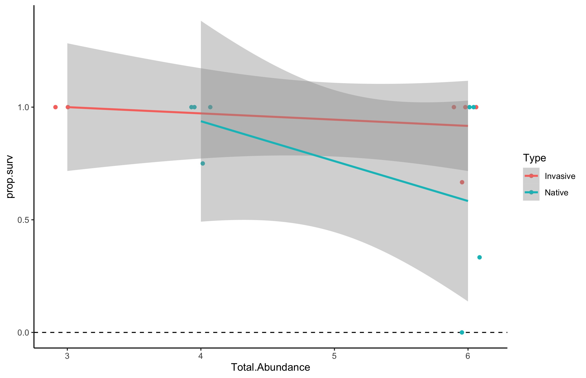
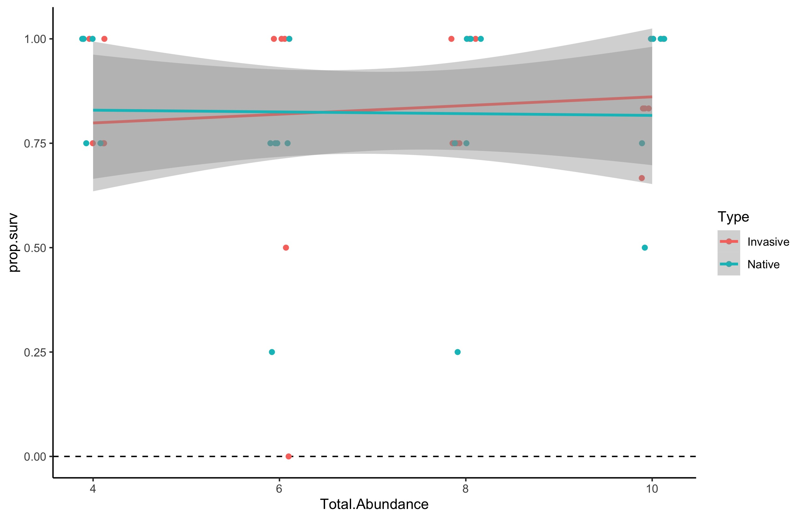

# Analysis of the mass change in the crayfish for the crayfish-litter-decomp exp

## Metadata

* File Created: 2021-06-17 - KF
* File Modified: 2021-07-07 - KF - based on discussions with SH, I am re-analyzing the data using the raw masses from each crayfish to generate an estimate of individual crayfish mass change, rather than tank mass change. I am also analyzing tank total mass at the end of the exp.
* File Modified: 2021-07-28 - KF - began adding code for the analysis of survival but did not complete the data summary or the data visualization.
* File Modified: 2021-08-18 - KF - completed analysis of mass change for 2015 experiment
* File Modified 2021-08-18 - KF - calculated survival of each species for each exp based on the raw data.

### Description

This code describes the analysis of the growth and survival data from the experiment evaluating invasive crayfish species density on the growth, survival and function (leaf litter consumption) of a native crayfish species using mesocosms. The experiment was conducted in 2016 in collaboration with Sujan Henkanaththegedara.  Additonal details on the experimental design and the output of the plots can be found at [https://github.com/KennyPeanuts/crayfish_leaf_decom](https://github.com/KennyPeanuts/crayfish_leaf_decom).

## Load packages

    library("tidyverse") # for data analysis and ggplot graphing
    library("ggpubr") # for plot creation and saving

## Analysis of Crayfish Growth Rate and Tank Final Mass

### Description

Initially the change in mass was measured as the final mass of the *tank* minus the initial mass of the *tank*. This measured the change in total crayfish mass in the tank and any dead crayfish were not incuded in the final mass (because they has been eaten). The results of this analysis can be seen below in [Analysis of Tank Mass Change](#analysis-of-tank-mass-change). As a result of this way of calculating mass change, tanks that had crayfish deaths could have negative growth.  This way of calculating mass change seemed to conflate the effects of individual crayfish growth and the total mass that a tank could support.

To better distingish between patterns in these two components of the ecology, we are analyzing them separately as the estimated change in mass of an individual crayfish and the total crayfish mass in the tank at the end of the experiment.

### Import Data

    cray.raw <- read.table("./data/crayfish_mass_raw.csv", header = T, sep = ",")
    
## Analysis of Experiment
    
### Create variables
    
#### Calculate the mean of the stocked mass and harvested mass for species in each tank

This code calculates the mean stocked mass and harvested mass of all the crayfish in each tank and produces a new data.frame with the values. The code also calculates the total mass of each species of crayfish at the end of the experiment.
    
    mean.mass <- cray.raw %>%
      group_by(Year, Type, Tank) %>%
        summarize(mean.Stocked.Mass = mean(Stocked_Mass, na.rm = T), sd.Stocked.Mass = sd(Stocked_Mass), mean.Harvested.Mass = mean(Harvested_Mass, na.rm = T), sd.Harvested.Mass = sd(Harvested_Mass), total.Harvested.Mass = sum(Harvested_Mass, na.rm = T))
    
#### Create a data.frame with the crayfish abundance of each tank not replicated for the number of crayfish

This code produces a data.frame with a single abundance value for each tank by using `unique` to select only a single abundance value from the replicate crayfish values.

    tank.abundance <- cray.raw %>%
      group_by(Year, Type, Tank) %>%
      summarize(Abundance = unique(Abundance), Total.Abundance = unique(Total_Abundance), Invasive.Abundance = unique(Invasive_Abundance))

#### Create a data.frame with the treatment designation of each tank not replicated for the number of crayfish

This code produces a data.frame with a single treatment value for each tank by using `unique` to select only a single abundance value from the replicate crayfish values.

    tank.treatment <- cray.raw %>%
      group_by(Year, Type, Tank) %>%
      summarize(Treatment = unique(Treatment))
    
#### Merge the mean.mass data.frame with the cray.raw data frame
    
    cray.mean <- 
      left_join(mean.mass, tank.abundance) 
    
    cray.mean <-
      left_join(cray.mean, tank.treatment)
    
## Survival Calculation 

This creates an object that contains the number of crayfish at the beginning of the experiment (stocked) and the number of crayfish at the end of the experiment (harvested) for each year, type of crayfish, and tank. This is used to calculate the number of crayfish that survived to the end of the experiment.

    cray.N <- 
      cray.raw %>%
      group_by(Year, Type, Tank) %>%
      summarize(N.initial = length(which(!is.na(Stocked_Mass))), N.final = length(which(!is.na(Harvested_Mass))))
    
### Calculate the proportion survived

This code calculates the proportion of the inital crayfish that remain in the tank at the end of the experiment.
    
    prop.surv <- cray.N$N.final / cray.N$N.initial
    
### Combine N with survival data
    
    cray.N <- data.frame(cray.N, prop.surv)
    
#### Merge the mean.mass data.frame with the cray.raw data frame
    
    cray.N <- 
      left_join(cray.N, tank.abundance) 
    
    cray.N <-
      left_join(cray.N, tank.treatment)
    
#### Calculate the estimated change in mass of an individual crayfish for each species.
    
This code subtracts the estmated stocked mass from the estimated harvested mass of a single crayfish in each tank.

    ind.delta.mass <- cray.mean$mean.Harvested.Mass - cray.mean$mean.Stocked.Mass
    
### Create data.frame for analyis
    
    cray.mean <- data.frame(cray.mean, ind.delta.mass)
    
#### Reorder the treatment levels in Treatment to reflect the logical order
    
    cray.mean$Treatment <- factor(cray.mean$Treatment, levels = c("Ctl_Native", "Ctl_Invasive", "Low", "Equal", "High"))

### Variable Descriptions
NOTE: These variable descriptions are for both the 'cray.N' and the 'cray.mean' data.frames.

* Year = the year of the study
* Type = the description of whether the crayfish is "Invasive" or "Native". Invasive crayfish were _P. clarkii_ in 2015, and _F. virilis_ in 2016. The Native crayfish were _C. sp. C_ in both years.
* Tank = the unique ID number of the experimental unit (tank).
* mean.Stocked.Mass = the mean mass of the crayfish stocked in the tank of a given treatment and crayfish type. (g)
* sd.Stocked.Mass = the standard deviation of the mean of the mass of the crayfish stocked in the tank of a given treatment and crayfish type. (g)
* mean.Harvested.Mass = the mean mass of the crayfish harvested from the tank of a given treatment and crayfish type at the end of the experiment. Missing (presumed dead) crayfish were not included in the mean. (g)
* sd.Harvested.Mass = the standard deviation of the mean of the mass of the crayfish harvested from the tank of a given treatment and crayfish type at the end of the experiment. (g)
* total.Harvested.Mass = the sum of the mass of the crayfish harvested from the tank of a given treatment and crayfish type at the end of the experiment. Missing (presumed dead) crayfish were not included in the sum. (g)
* Abundance = the number of crayfish of a given type stocked into each tank at the beginning of the experiment.
* Total.Abundance = the total number of crayfish in each tank (native + invasive) stocked into each tank at the beginning of the experiment.
* Invasive.Abundance = the number of invasive crayfish stocked into each tank at the beginning of the experiment.
* Treatment = the treatment level identifier, where "Ctl_Invasive" indicates a tank with only invasive crayfish, "Ctl_Native" indicates a tank with only native crayfish, "Equal" indicates a tank with equal numbers of invasive and native crayfish, "Low" indicates a tank with more native than invasive crayfish, and "High" indicates a tank with more invasive than native crayfish.
* ind.delta.mass = the estimated change in mass of a crayfish in a tank over the course of the experiment measured as the mean harvested mass minus the mean stocked mass. (g)
* N.initial = the number of crayfish of that type that were stocked into the tank at the beginnig of the experiment.
* N. final = the number of crayfish of that type that were harvested from the tank at the end of the experiment.
* prop.surv = the proportion of the stocked crayfish of that type ('N.initial') that were recovered at the end of the experiment.
    
### Statisitical Tests
#### 2015 Experiment
##### Mass

#### The effect of total crayfish abundance at the beginning of the exp on individual crayfish change in mass.
    
Based on the data there are two ways to analyze the results. One approach would be to treat the number of crayfish in the treatments as a continuous variable and analyze the data as an regression with `abundance` and `type` as a covariate.

##### Regression of mass change by total abundance 

    summary(lm(ind.delta.mass ~ Total.Abundance * Type, data = cray.mean, subset = Year == "2015"))
    
    ##################################################    
    all:
      lm(formula = ind.delta.mass ~ Total.Abundance * Type, data = cray.mean, 
         subset = Year == "2015")
    
    Residuals:
      Min      1Q  Median      3Q     Max 
    -2.3000 -1.2750  0.1938  0.9917  2.3000 
    
    Coefficients:
                               Estimate Std. Error t value Pr(>|t|)  
    (Intercept)                 6.59167    2.52294   2.613   0.0281 *
    Total.Abundance            -0.71944    0.48554  -1.482   0.1726  
    TypeNative                 -2.71181    4.06232  -0.668   0.5212  
    Total.Abundance:TypeNative -0.06979    0.80518  -0.087   0.9328  
    ---
    Residual standard error: 1.682 on 9 degrees of freedom
    (1 observation deleted due to missingness)
    Multiple R-squared:  0.6023,	Adjusted R-squared:  0.4697 
    F-statistic: 4.543 on 3 and 9 DF,  p-value: 0.03349
    ################################################## 
    
    anova(lm(ind.delta.mass ~ Total.Abundance * Type, data = cray.mean, subset = Year == "2015"))
    
    ##################################################
    Analysis of Variance Table
    
    Response: ind.delta.mass
    Df  Sum Sq Mean Sq F value   Pr(>F)   
    Total.Abundance       1  8.5028  8.5028  3.0056 0.117010   
    Type                  1 30.0364 30.0364 10.6173 0.009864 **
    Total.Abundance:Type  1  0.0213  0.0213  0.0075 0.932825   
    Residuals             9 25.4609  2.8290              
    ################################################## 
    
    ggplot(subset(cray.mean, Year == "2015"), mapping = aes(y = ind.delta.mass, x = Total.Abundance, color = Type)) +
             geom_point() +
             geom_smooth(
               method = "lm"
             ) +
             theme_classic()
    ggsave(filename = "ind.delta.mass.by.abundance.jpg", path = "./output/plots", dpi = 300)
    

    
##### ANOVA of change in mass by treatment
    
The other way to analyze the effect would be to treat the different abundance levels as a catagorical variable and analyze the effect on the response with a two-way ANOVA.
    
    anova(lm(ind.delta.mass ~ Treatment * Type, data = cray.mean, subset = Year == "2015"))
    
    ################################################## 
    Analysis of Variance Table
    
    Response: ind.delta.mass
    Df Sum Sq Mean Sq F value  Pr(>F)  
    Treatment  2 21.760  10.880  3.8459 0.06206 .
    Type       1 16.801  16.801  5.9387 0.03755 *
    Residuals  9 25.461   2.829 
    ################################################## 
    
    ggplot(subset(cray.mean, Year == "2015"), mapping = aes(y = ind.delta.mass, x = Treatment, color = Type)) +
             geom_point(
               position = position_jitterdodge(
                 dodge.width = 0.65,
                 jitter.width = 0.15
               )
               ) +
             stat_summary(
               fun = mean,
               fun.min = function(x) mean(x) - sd(x),
               fun.max = function(x) mean(x) + sd(x),
               position = position_dodge(width = 0.65)
              ) +
             theme_classic()
    ggsave(filename = "ind.delta.mass.by.treatment.2015.jpg", path = "./output/plots", dpi = 300)
    

    
#### Effect of abundance and treatment on final harvested mass
    
As with mass change there are two ways to analyze the data: regression analysis and ANCOVA.

##### Regression of final mass by abundance

In this model I am using a regression of harvested mass by the inital abundance in the tank with the type of crayfish as the covariate.

    summary(lm(total.Harvested.Mass ~ Total.Abundance * Type, data = cray.mean, subset = Year == "2015"))
    
    ##################################################
    Call:
      lm(formula = total.Harvested.Mass ~ Total.Abundance * Type, data = cray.mean, 
         subset = Year == "2015")
    
    Residuals:
      Min     1Q Median     3Q    Max 
    -12.97  -6.45   1.80   6.30  15.12 
    
    Coefficients:
      Estimate Std. Error t value Pr(>|t|)  
    (Intercept)                   5.700     14.103   0.404   0.6946  
    Total.Abundance               4.133      2.714   1.523   0.1588  
    TypeNative                   39.150     22.050   1.776   0.1062  
    Total.Abundance:TypeNative   -9.446      4.291  -2.201   0.0523 .
    ---
    Residual standard error: 9.402 on 10 degrees of freedom
    Multiple R-squared:  0.4254,	Adjusted R-squared:  0.2531 
    F-statistic: 2.468 on 3 and 10 DF,  p-value: 0.122
    
    ################################################## 
    
    anova(lm(total.Harvested.Mass ~ Total.Abundance * Type, data = cray.mean, subset = Year == "2015"))
    
    ################################################## 
    Analysis of Variance Table
    
    Response: total.Harvested.Mass
    Df Sum Sq Mean Sq F value  Pr(>F)  
    Total.Abundance       1   2.52    2.52  0.0285 0.86928  
    Type                  1 223.79  223.79  2.5316 0.14267  
    Total.Abundance:Type  1 428.27  428.27  4.8447 0.05235 .
    Residuals            10 884.01   88.40 
    ##################################################
    
    ggplot(subset(cray.mean, Year == "2015"), mapping = aes(y = total.Harvested.Mass, x = Total.Abundance, color = Type)) +
             geom_point() +
             geom_smooth(
               method = "lm"
             ) +
             theme_classic()
    ggsave(filename = "total.harvested.mass.by.abundance.2015.jpg", path = "./output/plots", dpi = 300)
    

    
##### ANOVA of total final mass by treatment
    
The second way to analyze the effect of the treatments on total final mass of crayfish is to run a 2-way ANOVA with the treatment levels.

    anova(lm(total.Harvested.Mass ~ Treatment * Type, data = cray.mean, subset = Year == "2015"))

    ##################################################
    Analysis of Variance Table
    
    Response: total.Harvested.Mass
    Df Sum Sq Mean Sq F value Pr(>F)  
    Treatment  2  40.34   20.17  0.2281 0.8000  
    Type       1 614.25  614.25  6.9485 0.0249 *
    Residuals 10 884.01   88.40 
    ################################################## 
    
    ggplot(subset(cray.mean, Year == "2015"), mapping = aes(y = total.Harvested.Mass, x = Treatment, color = Type)) +
             geom_point(
               position = position_jitterdodge(
                 dodge.width = 0.65,
                 jitter.width = 0.15
               )
               ) +
             stat_summary(
               fun = mean,
               fun.min = function(x) mean(x) - sd(x),
               fun.max = function(x) mean(x) + sd(x),
               position = position_dodge(width = 0.65)
              ) +
             theme_classic()
    ggsave(filename = "total.harvested.mass.by.treatment.2015.jpg", path = "./output/plots", dpi = 300)
    

#### Survival 
#### The effect of total crayfish abundance at the beginning of the exp on survival
    
##### Regression of mass change by total abundance 

    summary(lm(prop.surv ~ Total.Abundance * Type, data = cray.N, subset = Year == "2015"))
    
    ##################################################    
    Call:
      lm(formula = prop.surv ~ Total.Abundance * Type, data = cray.N, 
         subset = Year == "2015")
    
    Residuals:
      Min       1Q   Median       3Q      Max 
    -0.58333 -0.14062  0.06250  0.08333  0.41667 
    
    Coefficients:
                                Estimate   Std. Error t value Pr(>|t|)  
    (Intercept)                 1.08333    0.44502   2.434   0.0352 *
    Total.Abundance            -0.02778    0.08565  -0.324   0.7524  
    TypeNative                  0.56250    0.69578   0.808   0.4376  
    Total.Abundance:TypeNative -0.14931    0.13542  -1.103   0.2960  
    ---
    Residual standard error: 0.2967 on 10 degrees of freedom
    Multiple R-squared:  0.2994,	Adjusted R-squared:  0.08928 
    F-statistic: 1.425 on 3 and 10 DF,  p-value: 0.2928
    ################################################## 
    
    anova(lm(prop.surv ~ Total.Abundance * Type, data = cray.N, subset = Year == "2015"))
    
    ##################################################
    Analysis of Variance Table
    
    Response: prop.surv
    Df  Sum Sq  Mean Sq F value Pr(>F)
    Total.Abundance       1 0.15312 0.153125  1.7396 0.2166
    Type                  1 0.11611 0.116113  1.3192 0.2775
    Total.Abundance:Type  1 0.10700 0.107002  1.2156 0.2960
    Residuals            10 0.88021 0.088021  
    ################################################## 
    
There was no effect of the total abundance of crayfish in the tank (at the beginning of the exp) on the survival of the crayfish during the 2015 experiment.
    
    ggplot(subset(cray.N, Year == "2015"), mapping = aes(y = prop.surv, x = Total.Abundance, color = Type)) +
             geom_jitter(
               width = 0.1) +
             geom_smooth(
               method = "lm"
             ) +
             theme_classic()
    ggsave(filename = "prop.surv.by.abundance.2015.jpg", path = "./output/plots", dpi = 300)
    

    
##### ANOVA of survival by treatment
    
The other way to analyze the effect would be to treat the different abundance levels as a catagorical variable and analyze the effect on the response with a two-way ANOVA.
    
    anova(lm(prop.surv ~ Treatment * Type, data = cray.N, subset = Year == "2015"))
    
    ################################################## 
    Analysis of Variance Table
    
    Response: prop.surv
    Df  Sum Sq  Mean Sq F value Pr(>F)
    Treatment  2 0.15402 0.077009  0.8749 0.4465
    Type       1 0.22222 0.222222  2.5247 0.1432
    Residuals 10 0.88021 0.088021  
    ################################################## 
    
This analysis also shows no effect of the number of crayfish at the beginning of the experiment on survival. There is some non-homogenitiy of variance in this test but it seems unlikely this will affect the interpretation. 
    
    ggplot(subset(cray.N, Year == "2015"), mapping = aes(y = prop.surv, x = Treatment, color = Type)) +
             geom_point(
               position = position_jitterdodge(
                 dodge.width = 0.65,
                 jitter.width = 0.15
               )
               ) +
             stat_summary(
               fun = mean,
               fun.min = function(x) mean(x) - sd(x),
               fun.max = function(x) mean(x) + sd(x),
               position = position_dodge(width = 0.65)
              ) +
             theme_classic()
    ggsave(filename = "prop.surv.by.treatment.2015.jpg", path = "./output/plots", dpi = 300)
    

    
#### 2016 Experiment 
#### Mass

    
#### The effect of total crayfish abundance at the beginning of the exp on individual crayfish change in mass.
    
Based on the data there are two ways to analyze the results. One approach would be to treat the number of crayfish in the treatments as a continuous variable and analyze the data as an regression with `abundance` and `type` as a covariate.

##### Regression of mass change by total abundance 

    summary(lm(ind.delta.mass ~ Total.Abundance * Type, data = cray.mean, subset = Year == "2016"))
    
    ##################################################    
    Call:
      lm(formula = ind.delta.mass ~ Total.Abundance * Type, data = cray.mean, 
         subset = Year == "2016")
    
    Residuals:
      Min      1Q  Median      3Q     Max 
    -5.1168 -0.2979 -0.0123  0.5561  6.5832 
    
    Coefficients:
    Estimate Std. Error t value Pr(>|t|)    
    (Intercept)                  6.5237     1.1696   5.578  1.5e-06 ***
    Total.Abundance             -0.4095     0.1580  -2.591   0.0130 *  
    TypeNative                  -2.9992     1.6446  -1.824   0.0752 .  
    Total.Abundance:TypeNative   0.1872     0.2230   0.839   0.4059  
    
    ################################################## 
    
For mass change, the regression analysis shows that there is a significant effect of abundance on mass change overall and that there is no interaction between the types of crayfish.
    
To evaluate the effect of type we can report the results as an ANCOVA (the model is the same, the output just differs).

    anova(lm(ind.delta.mass ~ Total.Abundance * Type, data = cray.mean, subset = Year == "2016"))
    
    ##################################################
    Analysis of Variance Table
    
    Response: ind.delta.mass
    Df  Sum Sq Mean Sq F value   Pr(>F)   
    Total.Abundance       1  23.244  23.244  7.8249 0.007678 **
    Type                  1  33.338  33.338 11.2227 0.001690 **
    Total.Abundance:Type  1   2.093   2.093  0.7046 0.405887   
    Residuals            43 127.734   2.971                    
    ################################################## 
    
The ANCOVA results show a strongly significant effect of `type` on the mass change and a marginally significant effect of `abundance`. The difference in the results of the ANCOVA from the regression is that the ANCOVA is testing for the difference in means and not the difference of the slope from 0.
    
So, the way to interpret these results is that there is a strongly significant difference in the overall mean change in mass of the two types of crayfish (independent of the effect of abundance) and there is an overall negative effect of abundance on change in mass (independent of the effect of crayfish type). The lack of a significant interaction indicates that these results are fully independent.
    
    ggplot(subset(cray.mean, Year == "2016"), mapping = aes(y = ind.delta.mass, x = Total.Abundance, color = Type)) +
             geom_point() +
             geom_smooth(
               method = "lm"
             ) +
             theme_classic()
    ggsave(filename = "ind.delta.mass.by.abundance.jpg", path = "./output/plots", dpi = 300)
    

    
##### ANOVA of change in mass by treatment
    
The other way to analyze the effect would be to treat the different abundance levels as a catagorical variable and analyze the effect on the response with a two-way ANOVA.
    
    anova(lm(ind.delta.mass ~ Treatment * Type, data = cray.mean, subset = Year == "2016"))
    
    ################################################## 
    Analysis of Variance Table
    
    Response: ind.delta.mass
    Df  Sum Sq Mean Sq F value   Pr(>F)   
    Treatment       4  48.710 12.1776  3.9522 0.008696 **
    Type            1  15.816 15.8158  5.1330 0.029104 * 
    Treatment:Type  2   1.717  0.8586  0.2787 0.758286   
    Residuals      39 120.166  3.0812 
    
    ################################################## 
    
In this case we can see a highly signficant effect of both the treatment levels (which are the different combinations of the two species abundance) and species type. Again there is no interaction effect, indicating that the impacts are completely independent.
    
To further identify what is happening we can do a post-hoc test to determine which of the treatment levels are different from each other. Since there is no interaction effect, I am running the post-hoc test on the ANOVA with only Treatment as the independent variable.

    summary(aov(ind.delta.mass ~ Treatment, data = cray.mean, subset = Year == "2016"))
    TukeyHSD(aov(ind.delta.mass ~ Treatment, data = cray.mean, subset = Year == "2016"))
    
    ################################################## 
                 Df Sum Sq Mean Sq F value Pr(>F)  
    Treatment    4  48.71  12.178   3.714 0.0112 *
    Residuals   42 137.70   3.279
    
    $Treatment
    diff        lwr        upr     p adj
    Ctl_Invasive-Ctl_Native  2.70833333 -0.2708403  5.6875070 0.0904447 *
    Low-Ctl_Native           0.86212121 -1.7567186  3.4809610 0.8803408
    Equal-Ctl_Native        -0.38194444 -2.9619845  2.1980956 0.9931292
    High-Ctl_Native         -0.31513889 -2.8951789  2.2649011 0.9967234
    Low-Ctl_Invasive        -1.84621212 -4.4650519  0.7726277 0.2795084
    Equal-Ctl_Invasive      -3.09027778 -5.6703178 -0.5102377 0.0118326 ***
    High-Ctl_Invasive       -3.02347222 -5.6035123 -0.4434322 0.0144379 ***
    Equal-Low               -1.24406566 -3.3980046  0.9098733 0.4774801
    High-Low                -1.17726010 -3.3311991  0.9766789 0.5320882
    High-Equal               0.06680556 -2.0397883  2.1733994 0.9999842
    
    ################################################## 
    
The results of the ANOVA show that there is a significant difference between the invasive control and both the equal and high treatments. There is also a marginally significant difference between the native control and the invasive control.
    
In this case, the regression analysis seems to give more meaningful information. The negative effect of total abunance is clear as is the difference in the types of crayfish.
    
    ggplot(subset(cray.mean, Year == "2016"), mapping = aes(y = ind.delta.mass, x = Treatment, color = Type)) +
             geom_point(
               position = position_jitterdodge(
                 dodge.width = 0.65,
                 jitter.width = 0.15
               )
               ) +
             stat_summary(
               fun = mean,
               fun.min = function(x) mean(x) - sd(x),
               fun.max = function(x) mean(x) + sd(x),
               position = position_dodge(width = 0.65)
              ) +
             theme_classic()
    ggsave(filename = "ind.delta.mass.by.treatment.jpg", path = "./output/plots", dpi = 300)
    

    
#### Effect of abundance and treatment on final harvested mass
    
As with mass change there are two ways to analyze the data: regression analysis and ANCOVA.

##### Regression of final mass by abundance

In this model I am using a regression of harvested mass by the inital abundance in the tank with the type of crayfish as the covariate.

    summary(lm(total.Harvested.Mass ~ Total.Abundance * Type, data = cray.mean, subset = Year == "2016"))
    
    ##################################################
    Call:
      lm(formula = total.Harvested.Mass ~ Total.Abundance * Type, data = cray.mean, 
         subset = Year == "2016")
    
    Residuals:
      Min      1Q  Median      3Q     Max 
    -28.918  -4.803   1.168   6.372  28.012 
    
    Coefficients:
                               Estimate Std. Error t value Pr(>|t|)    
    (Intercept)                30.02833    7.79288   3.853 0.000375 ***
    Total.Abundance            -0.18500    1.06048  -0.174 0.862312    
    TypeNative                 -3.93333   11.02079  -0.357 0.722872    
    Total.Abundance:TypeNative -0.01667    1.49974  -0.011 0.991183 
    
    ################################################## 
    
The results show that there is no relationship between abundance and the final mass of the crayfish in the tank. Since the interaction is not significant, this applies independently to both species.
    
To investigate the effect of the species we can report the model results as an ANOVA to see the effect of the catagorical variable.

    anova(lm(total.Harvested.Mass ~ Total.Abundance * Type, data = cray.mean, subset = Year == "2016"))
    
    ################################################## 
    Analysis of Variance Table
    
    Response: total.Harvested.Mass
                          Df Sum Sq Mean Sq F value Pr(>F)
    Total.Abundance       1    9.0   8.971  0.0665 0.7977
    Type                  1  196.8 196.830  1.4585 0.2336
    Total.Abundance:Type  1    0.0   0.017  0.0001 0.9912
    Residuals            44 5937.9 134.953 
    
    ##################################################
    
In this case we can see that there is no difference in the final mass of the different types of crayfish.
    
    ggplot(subset(cray.mean, Year == "2016"), mapping = aes(y = total.Harvested.Mass, x = Total.Abundance, color = Type)) +
             geom_point() +
             geom_smooth(
               method = "lm"
             ) +
             theme_classic()
    ggsave(filename = "total.harvested.mass.by.abundance.jpg", path = "./output/plots", dpi = 300)
    

    
##### ANOVA of total final mass by treatment
    
The second way to analyze the effect of the treatments on total final mass of crayfish is to run a 2-way ANOVA with the treatment levels.

    anova(lm(total.Harvested.Mass ~ Treatment * Type, data = cray.mean, subset = Year == "2016"))

    ##################################################
    Analysis of Variance Table
    
    Response: total.Harvested.Mass
                    Df  Sum Sq Mean Sq F value    Pr(>F)    
    Treatment       4 2413.71  603.43  7.8183 9.393e-05 ***
    Type            1    4.13    4.13  0.0536   0.81815    
    Treatment:Type  2  638.64  319.32  4.1373   0.02327 *  
    Residuals      40 3087.27   77.18    
    
    ################################################## 
    
The results of this analysis show that there is a highly significant effect of treatment but no effect of species (type) on the total final mass. The signficant interaction indicates that the treatment effect was no independent of species. 
To explore this more fully, next I conduct a one-way ANOVA with post-hoc tests. I conduct separate tests for the two species because of the significant interaction.

    summary(aov(total.Harvested.Mass ~ Treatment, data = cray.mean, subset = Type == "Native" & Year == "2016"))
    
    ##################################################
                 Df Sum Sq Mean Sq F value Pr(>F)
    Treatment    3   68.9   22.97   0.355  0.786
    Residuals   20 1295.0   64.75 
    
    ##################################################
    
The results show no significant effect of the treatment on the total final mass of the Native crayfish.
    
    summary(aov(total.Harvested.Mass ~ Treatment, data = cray.mean, subset = Type == "Invasive" & Year == "2016"))
    TukeyHSD(aov(total.Harvested.Mass ~ Treatment, data = cray.mean, subset = Type == "Invasive" & Year == "2016"))
    
    ##################################################
    
    Df Sum Sq Mean Sq F value   Pr(>F)    
    Treatment    3   2791   930.2   10.38 0.000248 ***
    Residuals   20   1792    89.6  
    
    Tukey multiple comparisons of means
    95% family-wise confidence level
    
    Fit: aov(formula = total.Harvested.Mass ~ Treatment, data = cray.mean, subset = Type == "Invasive" & Year == "2016")
    
    $Treatment
    diff        lwr         upr     p adj
    Low-Ctl_Invasive   -28.233333 -43.530756 -12.9359103 0.0002548 ***
    Equal-Ctl_Invasive -15.783333 -31.080756  -0.4859103 0.0416372 *
    High-Ctl_Invasive   -5.383333 -20.680756   9.9140897 0.7594810
    Equal-Low           12.450000  -2.847423  27.7474230 0.1369486
    High-Low            22.850000   7.552577  38.1474230 0.0023957 *
    High-Equal          10.400000  -4.897423  25.6974230 0.2584053
    
    ################################################## 
    
For the Invasive crayfish there was a significant effect of treatment on the total final mass and the post-hoc test shows that the differences are between the control and the low and equal, and between the low and high.
    
    ggplot(subset(cray.mean, Year == "2016"), mapping = aes(y = total.Harvested.Mass, x = Treatment, color = Type)) +
             geom_point(
               position = position_jitterdodge(
                 dodge.width = 0.65,
                 jitter.width = 0.15
               )
               ) +
             stat_summary(
               fun = mean,
               fun.min = function(x) mean(x) - sd(x),
               fun.max = function(x) mean(x) + sd(x),
               position = position_dodge(width = 0.65)
              ) +
             theme_classic()
    ggsave(filename = "total.harvested.mass.by.treatment.jpg", path = "./output/plots", dpi = 300)
    

    
#### Survival 
#### The effect of total crayfish abundance at the beginning of the exp on survival
    
##### Regression of mass change by total abundance 

    summary(lm(prop.surv ~ Total.Abundance * Type, data = cray.N, subset = Year == "2016"))
    
    ##################################################    
    Call:
      lm(formula = prop.surv ~ Total.Abundance * Type, data = cray.N, 
         subset = Year == "2016")
    
    Residuals:
      Min       1Q   Median       3Q      Max 
    -0.81944 -0.07500 -0.02778  0.17917  0.20139 
    
    Coefficients:
                                Estimate Std. Error t value Pr(>|t|)    
    (Intercept)                 0.75694    0.15531   4.874 1.46e-05 ***
    Total.Abundance             0.01042    0.02114   0.493    0.625    
    TypeNative                  0.08056    0.21964   0.367    0.716    
    Total.Abundance:TypeNative -0.01250    0.02989  -0.418    0.678    
    
    Residual standard error: 0.2315 on 44 degrees of freedom
    Multiple R-squared:  0.005951,	Adjusted R-squared:  -0.06182 
    F-statistic: 0.08781 on 3 and 44 DF,  p-value: 0.9664
    ################################################## 
    
    anova(lm(prop.surv ~ Total.Abundance * Type, data = cray.N, subset = Year == "2016"))
    
    ##################################################
    Analysis of Variance Table
    
    Response: prop.surv
                          Df  Sum Sq  Mean Sq F value Pr(>F)
    Total.Abundance       1 0.00417 0.004167  0.0777 0.7817
    Type                  1 0.00058 0.000579  0.0108 0.9177
    Total.Abundance:Type  1 0.00937 0.009375  0.1749 0.6778
    Residuals            44 2.35856 0.053604      
    ################################################## 
    
There was no effect of the total abundance of crayfish in the tank (at the beginning of the exp) on the survival of the crayfish during the 2016 experiment.
    
    ggplot(subset(cray.N, Year == "2016"), mapping = aes(y = prop.surv, x = Total.Abundance, color = Type)) +
             geom_jitter(
               width = 0.1) +
             geom_smooth(
               method = "lm"
             ) +
             theme_classic()
    ggsave(filename = "prop.surv.by.abundance.2016.jpg", path = "./output/plots", dpi = 300)
    

    
##### ANOVA of survival by treatment
    
The other way to analyze the effect would be to treat the different abundance levels as a catagorical variable and analyze the effect on the response with a two-way ANOVA.
    
    anova(lm(prop.surv ~ Treatment * Type, data = cray.N, subset = Year == "2016"))
    
    ################################################## 
    Analysis of Variance Table
    
    Response: prop.surv
                    Df  Sum Sq  Mean Sq F value Pr(>F)
    Treatment       4 0.18403 0.046007  0.8512 0.5014
    Type            1 0.01235 0.012346  0.2284 0.6353
    Treatment:Type  2 0.01427 0.007137  0.1320 0.8767
    Residuals      40 2.16204 0.054051     
    ################################################## 
    
This analysis also shows no effect of the number of crayfish at the beginning of the experiment on survival. 
    
    ggplot(subset(cray.N, Year == "2016"), mapping = aes(y = prop.surv, x = Treatment, color = Type)) +
             geom_point(
               position = position_jitterdodge(
                 dodge.width = 0.65,
                 jitter.width = 0.15
               )
               ) +
             stat_summary(
               fun = mean,
               fun.min = function(x) mean(x) - sd(x),
               fun.max = function(x) mean(x) + sd(x),
               position = position_dodge(width = 0.65)
              ) +
             theme_classic()
    ggsave(filename = "prop.surv.by.treatment.2016.jpg", path = "./output/plots", dpi = 300)
    

    
    
##################################################    
# OLD ANALYSIS BELOW DO NOT USE
##################################################    
## Analysis of Tank Mass Change

## Import Data

    cray.2016 <- read.table("./data/crayfish_growth_surv.csv", header = T, sep = ",")
    
## Create Variables
    
    Sp.Abundance <- c(rep(4, 24), rep(4, 12), rep(6, 6), rep(2, 6))
    Total.Abundance <- c(rep(8, 6), rep(10, 6), rep(6, 6), rep(4, 6), rep(4, 6), rep(8, 6), rep(10, 6), rep(6, 6))
    Final.Sp.Abundance <- Sp.Abundance * (cray$Survival / 100)
    Final.Total.Abundance <- rep(Final.Sp.Abundance[cray$Species == "Native"] + Final.Sp.Abundance[cray$Species == "Invasive"], 2)
    Final.Invasive.Abundance <- c((Final.Total.Abundance[cray$Species == "Native"] - Final.Sp.Abundance[cray$Species == "Native"]), (Final.Total.Abundance[cray$Species == "Invasive"] - Final.Sp.Abundance[cray$Species == "Invasive"]))
    Invasive.Abundance <- c(rep(4, 6), rep(6, 6), rep(2, 6), rep(0, 6), rep(4, 6), rep(4, 6), rep(6, 6), rep(2, 6))
    
## Add Created Variables to the data.frame
    
    cray <- data.frame(cray, Sp.Abundance, Total.Abundance, Final.Sp.Abundance, Final.Total.Abundance, Invasive.Abundance, Final.Invasive.Abundance)
    
    
### Variable Descriptions    
    
* Species = the designation of native or invasive crayfish, where 'Native' = _Cambarus_ _sp C_ and 'Invasive' = _Faxonius virilis_.

* Density = the treatment designation where 'control' = 4 individuals of either the native or the invasive species alone, 'low' = 4 individuals of the native and 2 individuals of the invasive, 'equal' = 4 individuals of both the native and the invasive species, and 'high' = 4 individuals of the native species and 6 individuals of the invasive species.
    
* MassChange = the average change in mass of all of the crayfish of a group (native or invasive) over the course of the experiment (g). Negative numbers indicate an average loss of mass.
    
* LogMassChange = the log (base 10) of MassChange
    
* Survival = the percent of the original number of individuals that were alive a the end of the experiment.
    
* Sp.Abundance = the number of each crayfish of a given species in a treatment at the beginning of the experiment.

* Total.Abundance = the total number of crayfish in a treatment at the beginnig of the experiment.
    
* Final.Sp.Abundance = the number of crayfish of a given species in a treatment at the end of the experiment.

* Final.Total.Abundance = the number of crayfish in a treatment at the end of the experiment.

* Invasive.Abundance = the number of 'Invasive' crayfish in the a treatment at the beginning of the experiment. 

* Final.Invasive.Abundance = the number of 'Invasive' crayfish in the a treatment at the end of the experiment. 

## 2016 Experiment        
### Survival
    
    cray %>%
      group_by(Species, Density) %>%
        summarize(mean = mean(Survival), sd = sd(Survival), min = min(Survival), max = max(Survival))

    ##################################################     
    # Summary of the percent crayfish survied to the end of the experiment by species and treatment
    
    `summarise()` has grouped output by 'Species'. You can override using the `.groups` argument.
    # A tibble: 8 x 6
    # Groups:   Species [2]
    Species  Density  mean    sd   min   max
    <chr>    <chr>   <dbl> <dbl> <dbl> <dbl>
    1 Invasive control  83.3  12.9  75     100
    2 Invasive equal    87.5  13.7  75     100
    3 Invasive high     86.1  12.5  66.7   100
    4 Invasive low      75    41.8   0     100
    5 Native   control  91.7  12.9  75     100
    6 Native   equal    79.2  29.2  25     100
    7 Native   high     87.5  20.9  50     100
    8 Native   low      70.8  24.6  25     100
    
    ################################################## 
    
### Analysis of Survival
    
    summary(lm(Survival ~ Total.Abundance * Species, data = cray))
    
    ################################################## 
    Call:
lm(formula = Survival ~ Total.Abundance * Species, data = cray)

Residuals:
   Min     1Q Median     3Q    Max 
-81.94  -7.50  -2.78  17.92  20.14 

Coefficients:
                              Estimate Std. Error t value Pr(>|t|)    
(Intercept)                     75.695     15.531   4.874 1.46e-05 ***
Total.Abundance                  1.042      2.114   0.493    0.625    
SpeciesNative                    8.055     21.964   0.367    0.716    
Total.Abundance:SpeciesNative   -1.250      2.989  -0.418    0.678   

    ##################################################

    summary(aov(Survival ~ Density * Species, data = cray))
## Mass Change Analysis
### Comparison of the treatment groups on the change in mass
    
    anova(lm(MassChange ~ Density * Species, data = cray))
   
    ##################################################
    # 2-way ANOVA of the change in mass by treatment and species
    
    Analysis of Variance Table
    
    Response: MassChange
    Df  Sum Sq Mean Sq F value  Pr(>F)  
    Density          3  23.948  7.9826  1.3711 0.26546  
    Species          1  17.062 17.0623  2.9306 0.09466 .
    Density:Species  3  23.291  7.7637  1.3335 0.27703  
    Residuals       40 232.883  5.8221       
    
    ################################################## 
    
    mass_by_treat <-
    ggplot(cray, mapping = aes(y = MassChange, x = Density)) +
      facet_wrap(
        ~Species
        ) +
      geom_jitter(
        width = 0.1,
        col = 8
      ) +
      stat_summary(
        fun = mean,
        fun.min = function(x) mean(x) - sd(x),
        fun.max = function(x) mean(x) + sd(x)
      ) +
      theme_classic()
    
    ggexport(mass_by_treat, width = 7, height = 7, filename = "./output/plots/mass_by_treat.pdf")
    

    
The analysis by treatment group shows no effect of the treatment group and only a marginally significant effect of species.

    cray %>%
      group_by(Species) %>%
        summarize(mean = mean(MassChange), sd = sd(MassChange), min = min(MassChange), max = max(MassChange))
    
    ##################################################
    # Summary of mass change by species
    
    # A tibble: 2 x 5
    Species   mean    sd   min   max
    <chr>    <dbl> <dbl> <dbl> <dbl>
    1 Invasive  3.16  3.29 -7.85 10.6 
    2 Native    1.97  1.16 -1.8   3.75 
    
    ################################################## 
    
Given that the number of crayfish in the tanks could be considered a continuous variable, it may make more sense to think of mass change as a function of total crayfish in the tank.
    
    
    ggplot(cray, mapping = aes(y = MassChange, x = Total.Abundance, color = Species)) +
      geom_point() +
      geom_smooth(
        method = "lm"
      ) +
      theme_classic()
    
    ggplot(cray, mapping = aes(y = LogMassChange, x = Final.Total.Abundance, color = Species)) +
      geom_point() +
      geom_smooth(
        method = "lm"
      ) +
      theme_classic()
    
    ggplot(cray, mapping = aes(y = MassChange, x = Final.Invasive.Abundance, color = Species)) +
      geom_point() +
      geom_smooth(
        method = "lm"
      ) +
      theme_classic()
    
    ggplot(cray, mapping = aes(y = LogMassChange, x = Total.Abundance, color = Species)) +
      geom_point() +
      geom_smooth(
        method = "lm"
      ) +
      theme_classic()
    
    ggplot(cray, mapping = aes(y = LogMassChange, x = Invasive.Abundance, color = Species)) +
      geom_point() +
      geom_smooth(
        method = "lm"
      ) +
      theme_classic()
    
    summary(lm(MassChange ~ Total.Abundance * Species, data = cray))
    summary(lm(MassChange ~ Invasive.Abundance * Species, data = cray))
     