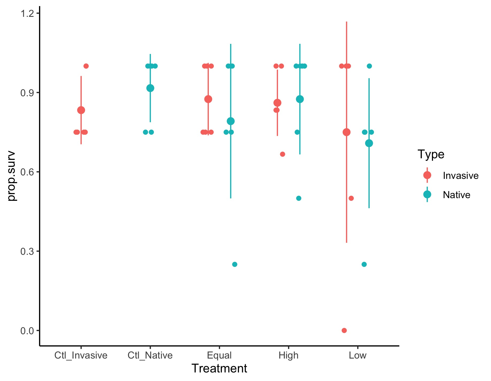

# Analysis of the mass change in the crayfish for the crayfish-litter-decomp exp

## Metadata

* File Created: 2021-06-17 - KF
* File Modified: 2021-07-07 - KF - based on discussions with SH, I am re-analyzing the data using the raw masses from each crayfish to generate an estimate of individual crayfish mass change, rather than tank mass change. I am also analyzing tank total mass at the end of the exp.
* File Modified: 2021-07-28 - KF - began adding code for the analysis of survival but did not complete the data summary or the data visualization.
* File Modified: 2021-08-18 - KF - completed analysis of mass change for 2015 experiment
* File Modified 2021-08-18 - KF - calculated survival of each species for each exp based on the raw data.
* File Modified 2021-08-26 - KF - completed the calculated survival of each species for each exp based on the raw data and added summaries of all the mass and survival data.
* File Modified 2021-09-02 - KF - I observed that the df were too great on the tests and realized that we were treating the different type of crayfish as independent samples when they are not. 
* File Modified 2021-09-15 - KF - added code to complete a linear mixed model test with tank as the random variable.
* File Modified 2022-05-24 - KF - clarified the calculation of the estimate for change in individual crayfish mass. I reconceptualized this as per capita mass change to make it easier to explain in the results.

### Description

This code describes the analysis of the growth and survival data from the experiment evaluating invasive crayfish species density on the growth, survival and function (leaf litter consumption) of a native crayfish species using mesocosms. The experiment was conducted in 2016 in collaboration with Sujan Henkanaththegedara.  Additonal details on the experimental design and the output of the plots can be found at [https://github.com/KennyPeanuts/crayfish_leaf_decom](https://github.com/KennyPeanuts/crayfish_leaf_decom).

## Load packages

    library("tidyverse") # for data analysis and ggplot graphing
    #library("ggpubr") # for plot creation and saving
    library("lme4") # permits linear mixed model construction
    library("lmerTest") # calculates p-values from linear mixed models

## Analysis of Crayfish Growth Rate and Tank Final Mass

### Description

Initially the change in mass was measured as the final mass of the *tank* minus the initial mass of the *tank*. This measured the change in total crayfish mass in the tank and any dead crayfish were not incuded in the final mass (because they has been eaten). The results of this analysis can be seen below in [Analysis of Tank Mass Change](#analysis-of-tank-mass-change). As a result of this way of calculating mass change, tanks that had crayfish deaths could have negative growth.  This way of calculating mass change seemed to conflate the effects of individual crayfish growth and survival.

To better distingish between patterns in these two components of the ecology, we are analyzing growth as per capita growth and suvival separately. To calculate the per capita growth for a tank, we took the mean initial mass of the tank, which is an estimate of the per capita mass of the crayfish in the tank (total mass / number of crayfish) and subtracted the mean mass (i.e., per capita mass) at the end of the incubation period. This generates a single per capita growth (i.e., change in mass) for each tank.

### Import Data

    cray.raw <- read.table(
    	"./data/crayfish_mass_raw.csv", 
    	header = T, 
    	sep = ","
    	)
    
## Analysis of Experiment
    
### Create variables
    
#### Calculate the mean of the stocked mass and harvested mass for species in each tank

This code calculates the mean stocked mass and harvested mass of all the crayfish in each tank and produces a new data.frame with the values. The code also calculates the total mass of each species of crayfish at the end of the experiment.
    
    mean.mass <- 
    	cray.raw %>%
      group_by(Year, Type, Tank) %>%
        summarize(
        	mean.Stocked.Mass = mean(Stocked_Mass, na.rm = T), 
        	sd.Stocked.Mass = sd(Stocked_Mass), 
        	mean.Harvested.Mass = mean(Harvested_Mass, na.rm = T), 
        	sd.Harvested.Mass = sd(Harvested_Mass), 
        	total.Harvested.Mass = sum(Harvested_Mass, na.rm = T)
        	)
    
#### Create a data.frame with the crayfish abundance of each tank not replicated for the number of crayfish

This code produces a data.frame with a single abundance value for each tank by using `unique` to select only a single abundance value from the replicate crayfish values.

    tank.abundance <- 
    	cray.raw %>%
      group_by(Year, Type, Tank) %>%
      summarize(
      	Abundance = unique(Abundance), 
      	Total.Abundance = unique(Total_Abundance), 
      	Invasive.Abundance = unique(Invasive_Abundance)
      	)

#### Create a data.frame with the treatment designation of each tank not replicated for the number of crayfish

This code produces a data.frame with a single treatment value for each tank by using `unique` to select only a single abundance value from the replicate crayfish values.

    tank.treatment <- 
    	cray.raw %>%
      group_by(Year, Type, Tank) %>%
      summarize(
      	Treatment = unique(Treatment)
      	)
    
#### Merge the mean.mass data.frame with the cray.raw data frame
    
    cray.mean <- 
      left_join(mean.mass, tank.abundance) 
    
    cray.mean <-
      left_join(cray.mean, tank.treatment)
    
## Survival Calculation 

This creates an object that contains the number of crayfish at the beginning of the experiment (stocked) and the number of crayfish at the end of the experiment (harvested) for each year, type of crayfish, and tank. This is used to calculate the number of crayfish that survived to the end of the experiment.

    cray.N <- 
      cray.raw %>%
      group_by(Year, Type, Tank) %>%
      summarize(
      	N.initial = length(which(!is.na(Stocked_Mass))), 
      	N.final = length(which(!is.na(Harvested_Mass)))
      	)
    
### Calculate the proportion survived

This code calculates the proportion of the inital crayfish that remain in the tank at the end of the experiment.
    
    prop.surv <- cray.N$N.final / cray.N$N.initial
    
### Combine N with survival data
    
    cray.N <- data.frame(cray.N, prop.surv)
    
#### Merge the mean.mass data.frame with the cray.raw data frame
    
    cray.N <- 
      left_join(cray.N, tank.abundance) 
    
    cray.N <-
      left_join(cray.N, tank.treatment)
    
#### Calculate the estimated change in mass of an individual crayfish for each species.
    
This code subtracts the per capita stocked mass from the per capita harvested mass in each tank to generate the per capita change in mass for each tank.

    per.capita.delta.mass <- 
    	cray.mean$mean.Harvested.Mass - cray.mean$mean.Stocked.Mass
    
### Create data.frame for analyis
    
    cray.mean <- data.frame(cray.mean, per.capita.delta.mass)
    
#### Reorder the treatment levels in Treatment to reflect the logical order
    
    cray.mean$Treatment <- factor(cray.mean$Treatment, levels = c("Ctl_Native", "Ctl_Invasive", "Low", "Equal", "High"))

    
# Variable Descriptions
NOTE: These variable descriptions are for both the 'cray.N' and the 'cray.mean' data.frames.

* Year = the year of the study
* Type = the description of whether the crayfish is "Invasive" or "Native". Invasive crayfish were _P. clarkii_ in 2015, and _F. virilis_ in 2016. The Native crayfish were _C. sp. C_ in both years.
* Tank = the unique ID number of the experimental unit (tank).
* mean.Stocked.Mass = the mean mass of the crayfish stocked in the tank of a given treatment and crayfish type. (g)
* sd.Stocked.Mass = the standard deviation of the mean of the mass of the crayfish stocked in the tank of a given treatment and crayfish type. (g)
* mean.Harvested.Mass = the mean mass of the crayfish harvested from the tank of a given treatment and crayfish type at the end of the experiment. Missing (presumed dead) crayfish were not included in the mean. (g)
* sd.Harvested.Mass = the standard deviation of the mean of the mass of the crayfish harvested from the tank of a given treatment and crayfish type at the end of the experiment. (g)
* total.Harvested.Mass = the sum of the mass of the crayfish harvested from the tank of a given treatment and crayfish type at the end of the experiment. Missing (presumed dead) crayfish were not included in the sum. (g)
* Abundance = the number of crayfish of a given type stocked into each tank at the beginning of the experiment.
* Total.Abundance = the total number of crayfish in each tank (native + invasive) stocked into each tank at the beginning of the experiment.
* Invasive.Abundance = the number of invasive crayfish stocked into each tank at the beginning of the experiment.
* Treatment = the treatment level identifier, where "Ctl_Invasive" indicates a tank with only invasive crayfish, "Ctl_Native" indicates a tank with only native crayfish, "Equal" indicates a tank with equal numbers of invasive and native crayfish, "Low" indicates a tank with more native than invasive crayfish, and "High" indicates a tank with more invasive than native crayfish.
* per.capita.delta.mass = the per capita change in mass estimated change in mass for a tank over the course of the experiment measured as the mean (i.e., per capita) harvested mass minus the mean (i.e., per capita) stocked mass. (g)
* N.initial = the number of crayfish of that type that were stocked into the tank at the beginnig of the experiment.
* N. final = the number of crayfish of that type that were harvested from the tank at the end of the experiment.
* prop.surv = the proportion of the stocked crayfish of that type ('N.initial') that were recovered at the end of the experiment.

### Statistical Summaries

#### Stocked Mass

    cray.mean %>%
      group_by(Year, Type) %>%
        summarize(
        	mean.stocked = mean(mean.Stocked.Mass), 
        	sd.stocked = sd(mean.Stocked.Mass), 
        	min.stocked = min(mean.Stocked.Mass), 
        	max.stocked = max(mean.Stocked.Mass), 
        	N = length(mean.Stocked.Mass)
        	)
    
    ##################################################
    # A tibble: 4 x 7
    # Groups:   Year [2]
       Year Type     mean.stocked sd.stocked  min.stocked  max.stocked   N
    <int> <chr>           <dbl>      <dbl>       <dbl>       <dbl> <int>
    1  2015 Invasive         6.34      4.12         1.6        11.1      6
    2  2015 Native           6.29      1.40         4.65        9.13     8
    3  2016 Invasive         5.19      1.65         3.12        9.2     24
    4  2016 Native           5.46      0.932        4.03        8.72    24
    ################################################## 
    
#### Harvested Mass

    cray.mean %>%
      group_by(Year, Type) %>%
        summarize(
        	mean.harvested = mean(mean.Harvested.Mass, na.rm = T), 
        	sd.harvested = sd(mean.Harvested.Mass, na.rm = T), 
        	min.harvested = min(mean.Harvested.Mass, na.rm = T), 
        	max.harvested = max(mean.Harvested.Mass, na.rm = T), 
        	N = length(mean.Harvested.Mass)
        	)
    
    ##################################################
    # A tibble: 4 x 7
    # Groups:   Year [2]
    Year Type     mean.harvested sd.harvested   min.harvested  max.harvested     N
    <int> <chr>             <dbl>        <dbl>         <dbl>         <dbl> <int>
    1  2015 Invasive           9.33         3.08          3.73         12.4      6
    2  2015 Native             6.42         1.77          3.7           9.37     8
    3  2016 Invasive           8.71         3.30          3.9          15.3     24
    4  2016 Native             7.43         1.48          2.7           9.78    24 
    
    # NOTE: NA`s were removed 
    ##################################################
    
#### Per capita Change in Mass
    
    cray.mean %>%
      group_by(Year, Type) %>%
      summarize(
      	mean.per.capita.delta.mass = mean(per.capita.delta.mass, na.rm = T), 
      	sd.per.capita.delta.mass = sd(per.capita.delta.mass, na.rm = T), 
      	min.per.capita.delta.mass = min(per.capita.delta.mass, na.rm = T), 
      	max.per.capita.delta.mass = max(per.capita.delta.mass, na.rm = T), 
      	N = length(per.capita.delta.mass)
      	) 
    

    ################################################## 
    # A tibble: 4 × 7
# Groups:   Year [2]
   Year Type     mean.per.capita… sd.per.capita.d… min.per.capita.… max.per.capita.…
  <int> <chr>               <dbl>            <dbl>            <dbl>            <dbl>
1  2015 Invasive           2.99               2.35            0.400             6.73
2  2015 Native             0.0464             1.18           -2.37              1.17
3  2016 Invasive           3.64               2.36           -1.05             10.6 
4  2016 Native             1.97               1.16           -1.8               3.75
# … with 1 more variable: N <int>
    ################################################## 
    
    
#### Survival

    cray.N %>%
      group_by(Year, Type) %>%
        summarize(
        	mean.prop.surv = mean(prop.surv, na.rm = T), 
        	sd.prop.surv = sd(prop.surv, na.rm = T), 
        	min.prop.surv = min(prop.surv, na.rm = T), 
        	max.prop.surv = max(prop.surv, na.rm = T), 
        	N = length(prop.surv)
        	)
    
    ##################################################
    # A tibble: 4 x 7
    # Groups:   Year [2]
        Year Type     mean.prop.surv sd.prop.surv min.prop.surv   max.prop.surv  N
    <int> <chr>             <dbl>        <dbl>         <dbl>         <dbl> <int>
    1  2015 Invasive          0.944        0.136         0.667             1     6
    2  2015 Native            0.760        0.387         0                 1     8
    3  2016 Invasive          0.830        0.227         0                 1    24
    4  2016 Native            0.823        0.227         0.25              1    24
    ################################################## 

#### Final Number

    cray.N %>%
      group_by(Year, Type, Treatment) %>%
        summarize(
        	mean.N.final = mean(N.final, na.rm = T), 
        	sd.N.final = sd(N.final, na.rm = T), 
        	min.N.final = min(N.final, na.rm = T), 
        	max.N.final = max(N.final, na.rm = T), 
        	N = length(N.final)
        	)
    
    ##################################################
    # A tibble: 12 x 8
    # Groups:   Year, Type [4]
        Year Type     Treatment    mean.N.final sd.N.final min.N.final max.N.final     N
    <int> <chr>    <chr>               <dbl>      <dbl>       <int>       <int> <int>
    1   2015 Invasive Ctl_Invasive         3         0               3           3     2
    2   2015 Invasive Equal                2.75      0.5             2           3     4
    3   2015 Native   Ctl_Native           3.75      0.5             3           4     4
    4   2015 Native   Equal                1.75      1.5             0           3     4
    5   2016 Invasive Ctl_Invasive         3.33      0.516           3           4     6
    6   2016 Invasive Equal                3.5       0.548           3           4     6
    7   2016 Invasive High                 5.17      0.753           4           6     6
    8   2016 Invasive Low                  1.5       0.837           0           2     6
    9   2016 Native   Ctl_Native           3.67      0.516           3           4     6
    10  2016 Native   Equal                3.17      1.17            1           4     6
    11  2016 Native   High                 3.5       0.837           2           4     6
    ################################################## 
    
## Statisitical Tests
    
Because both types of crayfish were "subsampled" from the same tank. Tank is the experimental unit and we need to use a linear mixed model to analyze the data.

## Mass (2015 Experiment)

The model uses the estimated change in per capita mass (`per.capita.delta.mass`) as the response and `Total.Abundance` and `Type` as the fixed effects and `Tank` as the random effect on which the error ie estimated.

    (delta.mass.tot.abundance.mod.2015 <- 
    		lmer(
    			per.capita.delta.mass ~ 1 + Total.Abundance * Type + (1|Tank), 
    			data = cray.mean, 
    			subset = Year == "2015"
    			)
    	)
    
    summary(delta.mass.tot.abundance.mod.2015)
    anova(delta.mass.tot.abundance.mod.2015)

    ################################################## 
    # Model Details
    Linear mixed model fit by REML ['lmerModLmerTest']
    Formula: per.capita.delta.mass ~ 1 + Total.Abundance * Type + (1 | Tank)
    Data: cray.mean
    Subset: Year == "2015"
    REML criterion at convergence: 41.6386
    Random effects:
    Groups   Name        Std.Dev.
    Tank     (Intercept) 1.3565  
    Residual             0.9577  
    Number of obs: 13, groups:  Tank, 10
    Fixed Effects:
               (Intercept)             Total.Abundance                  TypeNative  
                   6.59167                    -0.71944                    -3.15301  
                   Total.Abundance:TypeNative  
                   0.04051 
    
    # Sumary of results as a regression analysis
    
    > summary(delta.mass.tot.abundance.mod.2015)
    Linear mixed model fit by REML. t-tests use Satterthwaites method ['lmerModLmerTest']
    Formula: ind.delta.mass ~ 1 + Total.Abundance * Type + (1 | Tank)
    Data: cray.mean
    Subset: Year == "2015"
    
    REML criterion at convergence: 41.6
    
    Scaled residuals: 
    Min      1Q  Median      3Q     Max 
    -0.8827 -0.3583 -0.1122  0.3444  0.9887 
    
    Random effects:
    Groups   Name        Variance Std.Dev.
    Tank     (Intercept) 1.8402   1.3565  
    Residual             0.9172   0.9577  
    Number of obs: 13, groups:  Tank, 10
    
    Fixed effects:
    Estimate Std. Error       df t value Pr(>|t|)  
    (Intercept)                 6.59167    2.49084  7.88010   2.646   0.0298 *
    Total.Abundance            -0.71944    0.47936  7.88010  -1.501   0.1724  
    TypeNative                 -3.15301    3.71962  8.73557  -0.848   0.4192  
    Total.Abundance:TypeNative  0.04051    0.67304  8.91100   0.060   0.9533  
    ---
    
    Correlation of Fixed Effects:
    (Intr) Ttl.Ab TypNtv
    Totl.Abndnc -0.962              
    TypeNative  -0.570  0.472       
    Ttl.Abnd:TN  0.548 -0.475 -0.984
    
    # Summary of results as an ANOVA 
    > anova(delta.mass.tot.abundance.mod.2015)
    Type III Analysis of Variance Table with Satterthwaites method
    Sum Sq Mean Sq NumDF  DenDF F value Pr(>F)
    Total.Abundance      2.36101 2.36101     1 7.0898  2.5741 0.1521
    Type                 0.65907 0.65907     1 8.7356  0.7185 0.4192
    Total.Abundance:Type 0.00332 0.00332     1 8.9110  0.0036 0.9533
    ################################################## 
    
#### Plot of the 2015 Experiment Change in Mass by Total Abundance
    
    ggplot(
    	subset(
    		cray.mean, Year == "2015"
    		), 
    	mapping = aes(
    		y = per.capita.delta.mass,
    		x = Total.Abundance, 
    		shape = Type,
    		linetype = Type
    		)
    	) +
    	   geom_hline(
    	     yintercept = 0,
    	     linetype = "dashed"
    	    ) +
    	    geom_point(
    	     position = position_jitterdodge(
    	      dodge.width = 0.1,
    	      jitter.width = 0.2,
    	       ),
    	     size = 2.5
    	     )+
           geom_smooth(
            method = "lm",
           	color = "gray45"
           ) +
    	     xlab(
    	     	"Total Number of Crayfish in the Tank"
    	     )+
    	     ylab(
    	     	"Per capita change in mass (g)"
    	     )+
    	scale_shape_manual(
    		values = c(19, 1)
    	)+
       theme_classic()
    
    ggsave(
    	filename = "per_capita_delta_mass_by_abundance_2015.jpg", 
    	path = "./output/plots", 
    	dpi = 300
    	)
    

    
	    ggplot(subset(
	    	cray.mean, Year == "2015"
	    	), 
	    	mapping = aes(
	    		y = per.capita.delta.mass, 
	    		x = Treatment, 
	    		shape = Type)) +
             geom_point(
               position = position_jitterdodge(
                 dodge.width = 0.65,
                 jitter.width = 0.15
               ),
             	size = 3
               ) +
             stat_summary(
               fun = mean,
               fun.min = function(x) mean(x) - sd(x),
               fun.max = function(x) mean(x) + sd(x),
               position = position_dodge(width = 0.65),
             	color = "gray45"
              ) +
    	   geom_hline(
    	     yintercept = 0,
    	     linetype = "dashed"
    	    ) +
    	scale_shape_manual(
    		values = c(19, 1)
    	)+
	    	xlab(
	    		"Treatment"
	    	)+
	    	ylab(
	    		"Per capita change in mass (g)"
	    	)+
             theme_classic()
	    
    ggsave(
    	filename = "per_capita_delta_mass_by_treatment_2015.jpg", 
    	path = "./output/plots", 
    	dpi = 300
    	)
    
[per_capita_delta_mass_by_treatment_2015.jpg](../output/plots/per_capita_delta_mass_by_treatment_2015.jpg)
    
### Description of the 2015 Experiment Change in Mass Results
    
In the 2015 experiment there was no significant effect of the total abundance of crayfish in the tank at the end of the experiment on the per capita change in crayfish mass (p = 0.1724). The effect of total abundance was determined for the grand mean of all crayfish but the lack of a significant interaction (p = 0.9533) indicates that the two species did not differ in their response to the total abundance of crayfish.

The mean (+/- 1 SD) per capita change in the invasive crayfish mass was 2.99 (+/- 2.35) g, while the mean per capita change in the native crayfish mass was only 0.05 (+/- 1.18) g. However this difference was not significant (p = 0.4192) so we do not have evidence that the invasive grew more than the native in the 2015 experiment.
    
## Survival (2015 Experiment)

The model uses the proportion of crayfish that survive to the end of the experiment (`prop.surv`) and `Total.Abundance` and `Type` as the fixed effects and `Tank` as the random effect on which the error ie estimated.

    (survival.tot.abundance.mod.2015 <- 
    		lmer(
    			prop.surv ~ 1 + Total.Abundance * Type + (1|Tank),
    			data = cray.N, 
    			subset = Year == "2015"
    			)
    	)
    
    summary(survival.tot.abundance.mod.2015)
    anova(survival.tot.abundance.mod.2015)
    
    ################################################## 
    # Model Details
    (survival.tot.abundance.mod.2015 <- lmer(prop.surv ~ 1 + Total.Abundance * Type + (1|Tank) , data = cray.N, subset = Year == "2015"))
    boundary (singular) fit: see ?isSingular
    Linear mixed model fit by REML ['lmerModLmerTest']
    Formula: prop.surv ~ 1 + Total.Abundance * Type + (1 | Tank)
    Data: cray.N
    Subset: Year == "2015"
    REML criterion at convergence: 12.5125
    Random effects:
      Groups   Name        Std.Dev.
    Tank     (Intercept) 0.0000  
    Residual             0.2967  
    Number of obs: 14, groups:  Tank, 10
    Fixed Effects:
      (Intercept)             Total.Abundance                  TypeNative  
    1.08333                    -0.02778                     0.56250  
    Total.Abundance:TypeNative  
    -0.14931  
    optimizer (nloptwrap) convergence code: 0 (OK) ; 0 optimizer warnings; 1 lme4 warnings 
    
    # Summary of Results as a Regression Analysis
    
    summary(survival.tot.abundance.mod.2015)
    Linear mixed model fit by REML. t-tests use Satterthwaites method ['lmerModLmerTest']
    Formula: prop.surv ~ 1 + Total.Abundance * Type + (1 | Tank)
    Data: cray.N
    Subset: Year == "2015"
    
    REML criterion at convergence: 12.5
    
    Scaled residuals: 
    Min      1Q  Median      3Q     Max 
    -1.9662 -0.4740  0.2107  0.2809  1.4044 
    
    Random effects:
    Groups   Name        Variance Std.Dev.
    Tank     (Intercept) 0.00000  0.0000  
    Residual             0.08802  0.2967  
    Number of obs: 14, groups:  Tank, 10
    
    Fixed effects:
    Estimate Std. Error       df t value Pr(>|t|)  
    (Intercept)                 1.08333    0.44502 10.00000   2.434   0.0352 *
    Total.Abundance            -0.02778    0.08565 10.00000  -0.324   0.7524  
    TypeNative                  0.56250    0.69578 10.00000   0.808   0.4376  
    Total.Abundance:TypeNative -0.14931    0.13542 10.00000  -1.103   0.2960  
    ---
    
    Correlation of Fixed Effects:
    (Intr) Ttl.Ab TypNtv
    Totl.Abndnc -0.962              
    TypeNative  -0.640  0.615       
    Ttl.Abnd:TN  0.609 -0.632 -0.973
    optimizer (nloptwrap) convergence code: 0 (OK)
    boundary (singular) fit: see ?isSingular
    
    # Summary of Results as an ANOVA Analysis
    
    anova(survival.tot.abundance.mod.2015)
    Type III Analysis of Variance Table with Satterthwaites method
    Sum Sq  Mean Sq NumDF DenDF F value Pr(>F)
    Total.Abundance      0.201447 0.201447     1    10  2.2886 0.1613
    Type                 0.057528 0.057528     1    10  0.6536 0.4376
    Total.Abundance:Type 0.107002 0.107002     1    10  1.2156 0.2960
    ################################################## 
    
#### Plot of 2015 Experiment Proportion Surviving by Total Abundance
    
    ggplot(
    	subset(cray.N, Year == "2015"),
    	mapping = aes(
    		y = (prop.surv * 100),
    		x = Total.Abundance, 
    		shape = Type,
    		linetype = Type
    		)
    	) +
    	       geom_hline(
    	       	yintercept = 0,
    	       	linetype = "dashed"
    	       ) +
    	       geom_point(
    	       	position = position_jitterdodge(
    	       		dodge.width = 0.6,
    	       		jitter.width = 0.3
    	       	),
    	       	size = 2.5
    	       	)+
             geom_smooth(
              method = "lm",
             	color = "gray45"
             ) +
    	scale_shape_manual(
    		values = c(19, 1)
    	)+
	    	xlab(
	    		"Total Number of Crayfish in the Tank"
	    	)+
	    	ylab(
	    		"Percent Crayfish Survival"
	    	)+
             theme_classic()
    
    ggsave(filename = "prop_surv_by_abundance_2015.jpg", path = "./output/plots", dpi = 300)
    

    
#### Plot of 2015 Experiment Proportion Surviving by Treatment
    
    ggplot(subset(cray.N, Year == "2015"), mapping = aes(y = prop.surv, x = Treatment, color = Type)) +
             geom_point(
               position = position_jitterdodge(
                 dodge.width = 0.65,
                 jitter.width = 0.15
               )
               ) +
             stat_summary(
               fun = mean,
               fun.min = function(x) mean(x) - sd(x),
               fun.max = function(x) mean(x) + sd(x),
               position = position_dodge(width = 0.65)
              ) +
             theme_classic()
    ggsave(filename = "prop.surv.by.treatment.2015.jpg", path = "./output/plots", dpi = 300)
    
[prop.surv.by.treatment.2015.jpg](../output/plots/prop.surv.by.treatment.2015.jpg)
    
## Description of the 2015 Experiment Survival Results
    
In the 2015 experiment there was no effect of the total abundance of crayfish on the proportion of crayfish that survived to the end of the experiment (p = 0.7524). The non-significan interaction effect (p = 0.2960) indicates that there was no difference in the effect of the total abundance of crayfish on the proportion survivied between the types of crayfish.

A mean (+/- 1 SD) proportion of 0.944 (+/- 0.135) of the invasive crayfish survived to the end of the experiment and this was not significantly different from the mean proportion of 0.760 (+/- 0.387) native crayfish that survived to the end of the experiment.
    
## Mass (2016 Experiment)

The model uses the per capita change in crayfish mass (`per.capita.delta.mass`) from the 2016 experiment as the response and `Total.Abundance` and `Type` as the fixed effects and `Tank` as the random effect on which the error is estimated.

    (delta.mass.tot.abundance.mod.2016 <- 
    		lmer(
    			per.capita.delta.mass ~ 1 + Total.Abundance * Type + (1|Tank), 
    			data = cray.mean, 
    			subset = Year == "2016"
    			)
    	)
    
    summary(delta.mass.tot.abundance.mod.2016)
    anova(delta.mass.tot.abundance.mod.2016)
    
    ################################################## 
    # Model Results
    (delta.mass.tot.abundance.mod.2016 <- lmer(ind.delta.mass ~ 1 + Total.Abundance * Type + (1|Tank) , data = cray.mean, subset = Year == "2016"))
    boundary (singular) fit: see ?isSingular
    Linear mixed model fit by REML ['lmerModLmerTest']
    Formula: ind.delta.mass ~ 1 + Total.Abundance * Type + (1 | Tank)
    Data: cray.mean
    Subset: Year == "2016"
    REML criterion at convergence: 184.7249
    Random effects:
      Groups   Name        Std.Dev.
    Tank     (Intercept) 0.000   
    Residual             1.724   
    Number of obs: 47, groups:  Tank, 30
    Fixed Effects:
      (Intercept)             Total.Abundance                  TypeNative  
    6.5237                     -0.4095                     -2.9992  
    Total.Abundance:TypeNative  
    0.1872  
    
    # Summary of results as a regression Analysis
    
    summary(delta.mass.tot.abundance.mod.2016)
    Linear mixed model fit by REML. t-tests use Satterthwaites method ['lmerModLmerTest']
    Formula: ind.delta.mass ~ 1 + Total.Abundance * Type + (1 | Tank)
    Data: cray.mean
    Subset: Year == "2016"
    
    REML criterion at convergence: 184.7
    
    Scaled residuals: 
    Min      1Q  Median      3Q     Max 
    -2.9688 -0.1728 -0.0071  0.3226  3.8196 
    
    Random effects:
    Groups   Name        Variance Std.Dev.
    Tank     (Intercept) 0.000    0.000   
    Residual             2.971    1.724   
    Number of obs: 47, groups:  Tank, 30
    
    Fixed effects:
    Estimate Std. Error      df t value Pr(>|t|)    
    (Intercept)                  6.5237     1.1696 43.0000   5.578  1.5e-06 ***
    Total.Abundance             -0.4095     0.1580 43.0000  -2.591   0.0130 *  
    TypeNative                  -2.9992     1.6446 43.0000  -1.824   0.0752 .  
    Total.Abundance:TypeNative   0.1872     0.2230 43.0000   0.839   0.4059    
    ---
    Correlation of Fixed Effects:
    (Intr) Ttl.Ab TypNtv
    Totl.Abndnc -0.952              
    TypeNative  -0.711  0.677       
    Ttl.Abnd:TN  0.674 -0.709 -0.952
    optimizer (nloptwrap) convergence code: 0 (OK)
    boundary (singular) fit: see ?isSingular
    
    # Summary of Results as an ANOVA
    
    anova(delta.mass.tot.abundance.mod.2016)
    Type III Analysis of Variance Table with Satterthwaites method
    Sum Sq Mean Sq NumDF DenDF F value   Pr(>F)   
    Total.Abundance      23.8431 23.8431     1    43  8.0264 0.006991 **
    Type                  9.8794  9.8794     1    43  3.3258 0.075158 . 
    Total.Abundance:Type  2.0930  2.0930     1    43  0.7046 0.405887   
    ################################################## 
    
### Plot of the 2016 Experiment Change in Mass by Total Abundance
    
    ggplot(
    	subset(cray.mean, Year == "2016"), 
    	mapping = aes(
    		y = per.capita.delta.mass, 
    		x = Total.Abundance, 
    		shape = Type,
    		linetype = Type
    		)
    	) +
    	       geom_hline(
    	       	yintercept = 0,
    	       	linetype = "dashed"
    	       ) +
    	       geom_point(
    	       	position = position_jitterdodge(
    	       		dodge.width = 0.1,
    	       		jitter.width = 0.2
    	       	),
    	       	size = 2.5
    	       	)+
             geom_smooth(
               method = "lm",
             	color = "gray45"
             ) +
    	scale_shape_manual(
    		values = c(19, 1)
    	)+
	    	xlab(
	    		"Total Number of Crayfish in a Tank"
	    	)+
	    	ylab(
	    		"Per capita change in mass (g)"
	    	)+
        theme_classic()
    
    ggsave(filename = "per_capita_delta_mass_by_abundance_2016.jpg", path = "./output/plots", dpi = 300)
    

### Plot of the 2016 Experiment Change in Mass by Treatment
    
    ggplot(subset(cray.mean, Year == "2016"), mapping = aes(y = ind.delta.mass, x = Treatment, color = Type)) +
             geom_point(
               position = position_jitterdodge(
                 dodge.width = 0.65,
                 jitter.width = 0.15
               )
               ) +
             stat_summary(
               fun = mean,
               fun.min = function(x) mean(x) - sd(x),
               fun.max = function(x) mean(x) + sd(x),
               position = position_dodge(width = 0.65)
              ) +
             theme_classic()
    ggsave(filename = "ind_delta_mass_by_treatment_2016.jpg", path = "./output/plots", dpi = 300)
    

    
## Description of the 2016 Experiment Change in Mass Results
    
In the 2016 experiment there was a significant negative effect of total abundance on the estimated change in the mass of an individual crayfish (p = 0.0130). The regression shows that there is a loss of 0.4095 g of mass change for each crayfish added to total abundance. The non-significant interaction (p = 0.4059) indicates that the effect of total abundance on the estimated change in mass of an individual crayfish was the same for both the invasive and native crayfish.

The mean (+/- 1 SD) estimated change in mass of an individual invasive crayfish was 3.64 (+/- 2.36) g and the mean estimated change in mass of an individual native crayfish was 1.97 (+/- 1.16) g but this difference was not significant at an alpha = 0.05 (p = 0.0752).

## Survival (2016 Experiment)

The model uses the proportion of crayfish that survive to the end of the experiment (`prop.surv`) and `Total.Abundance` and `Type` as the fixed effects and `Tank` as the random effect on which the error ie estimated.

    (survival.tot.abundance.mod.2016 <- lmer(prop.surv ~ 1 + Total.Abundance * Type + (1|Tank) , data = cray.N, subset = Year == "2016"))
    
    summary(survival.tot.abundance.mod.2016)
    anova(survival.tot.abundance.mod.2016)
   
    ################################################## 
    # Model Details
    
    (survival.tot.abundance.mod.2016 <- lmer(prop.surv ~ 1 + Total.Abundance * Type + (1|Tank) , data = cray.N, subset = Year == "2016"))
    boundary (singular) fit: see ?isSingular
    Linear mixed model fit by REML ['lmerModLmerTest']
    Formula: prop.surv ~ 1 + Total.Abundance * Type + (1 | Tank)
    Data: cray.N
    Subset: Year == "2016"
    REML criterion at convergence: 12.0477
    Random effects:
      Groups   Name        Std.Dev.
    Tank     (Intercept) 0.0000  
    Residual             0.2315  
    Number of obs: 48, groups:  Tank, 30
    Fixed Effects:
      (Intercept)             Total.Abundance                  TypeNative  
    0.75694                     0.01042                     0.08056  
    Total.Abundance:TypeNative  
    -0.01250  
    optimizer (nloptwrap) convergence code: 0 (OK) ; 0 optimizer warnings; 1 lme4 warnings 
    
    # Summary of Results as a Regression
    
    summary(survival.tot.abundance.mod.2016)
    Linear mixed model fit by REML. t-tests use Satterthwaites method ['lmerModLmerTest']
    Formula: prop.surv ~ 1 + Total.Abundance * Type + (1 | Tank)
    Data: cray.N
    Subset: Year == "2016"
    
    REML criterion at convergence: 12
    
    Scaled residuals: 
    Min      1Q  Median      3Q     Max 
    -3.5393 -0.3239 -0.1200  0.7739  0.8698 
    
    Random effects:
    Groups   Name        Variance Std.Dev.
    Tank     (Intercept) 0.0000   0.0000  
    Residual             0.0536   0.2315  
    Number of obs: 48, groups:  Tank, 30
    
    Fixed effects:
    Estimate Std. Error       df t value Pr(>|t|)    
    (Intercept)                 0.75694    0.15531 44.00000   4.874 1.46e-05 ***
    Total.Abundance             0.01042    0.02114 44.00000   0.493    0.625    
    TypeNative                  0.08056    0.21964 44.00000   0.367    0.716    
    Total.Abundance:TypeNative -0.01250    0.02989 44.00000  -0.418    0.678    
    
    Correlation of Fixed Effects:
    (Intr) Ttl.Ab TypNtv
    Totl.Abndnc -0.953              
    TypeNative  -0.707  0.674       
    Ttl.Abnd:TN  0.674 -0.707 -0.953
    optimizer (nloptwrap) convergence code: 0 (OK)
    boundary (singular) fit: see ?isSingular
    
    # Summary of the Results as an ANOVA
    
    Type III Analysis of Variance Table with Satterthwaites method
                        Sum Sq   Mean Sq NumDF DenDF F value Pr(>F)
    Total.Abundance      0.0041667 0.0041667     1    44  0.0777 0.7817
    Type                 0.0072102 0.0072102     1    44  0.1345 0.7156
    Total.Abundance:Type 0.0093750 0.0093750     1    44  0.1749 0.6778
    
    ################################################## 
    
#### Plot of the 2016 Experiment Survival by Total Abundance
    
    ggplot(subset(cray.N, Year == "2016"), mapping = aes(y = prop.surv, x = Total.Abundance, color = Type)) +
    	       geom_hline(
    	       	yintercept = 0,
    	       	linetype = "dashed"
    	       ) +
    	       geom_point(
    	       	position = position_jitterdodge(
    	       		dodge.width = 0.1,
    	       		jitter.width = 0.3
    	       	)
    	       	)+
             geom_smooth(
               method = "lm"
             ) +
             theme_classic()
    ggsave(filename = "prop.surv.by.abundance.2016.jpg", path = "./output/plots", dpi = 300)
    

    
#### Plot of the 2016 Experiment Survival by Treatment
    
    ggplot(subset(cray.N, Year == "2016"), mapping = aes(y = prop.surv, x = Treatment, color = Type)) +
             geom_point(
               position = position_jitterdodge(
                 dodge.width = 0.65,
                 jitter.width = 0.15
               )
               ) +
             stat_summary(
               fun = mean,
               fun.min = function(x) mean(x) - sd(x),
               fun.max = function(x) mean(x) + sd(x),
               position = position_dodge(width = 0.65)
              ) +
             theme_classic()
    ggsave(filename = "prop.surv.by.treatment.2016.jpg", path = "./output/plots", dpi = 300)
    

    
## Description of the 2016 Experiment Survival Results
    
There was no effect of total abundance on the proportion of crayfish that survived to the end of the experiment in 2016 (p = 0.625) and the non-significant interaction (p = 0.678) indicates that there is not evidence that abundance is affecting the native and invasive crayfish differently.

The mean (+/- 1 SD) proportion of invasive crayfish that survived to the end of the experiment was 0.830 (+/- 0.227) which was nearly identical to the proportion of 0.823 (+/- 0.227) for the native crayfish that survived to the end of the experiment. There was no significant difference between the proportion of invasive and native crayfish that survived to the end of the experiment (p = 0.716).