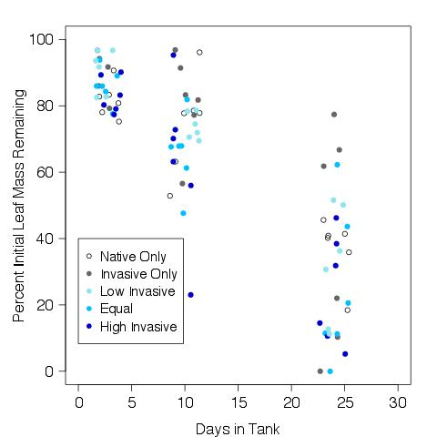
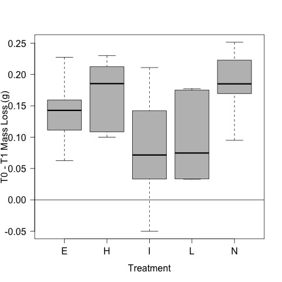
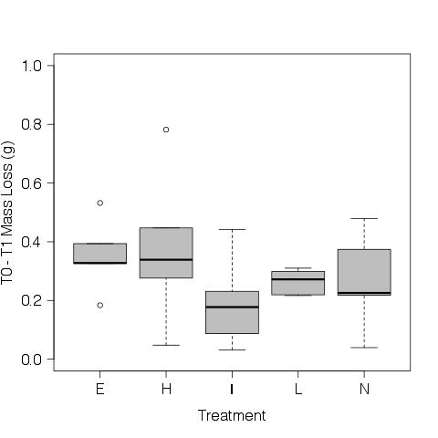
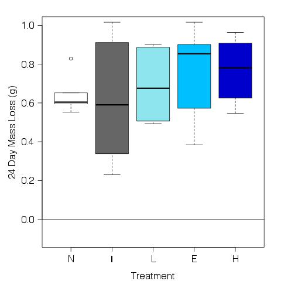

# Analysis of the leaf mass loss from the decomposition 

## Metadata

* File created on 10 June 2016 - KF

* 22 june 2016 - KF - added T2 to the analysis

* 5 July 2016 - KF - added T3 to the analysis

## Description

This is the code to calculate the mass loss of the leaf packs in the experiment evaluating the impact of in invasive and native crayfish.

## R Code

### Import data

    leaf.initial <- read.table("./data/initial_leaf_mass.csv", header = T, sep = ",")
    leaf.T1 <- read.table("./data/T1_leaf_mass.csv", header = T, sep = ",")
    leaf.T2 <- read.table("./data/T2_leaf_mass.csv", header = T, sep = ",")
    leaf.T3 <- read.table("./data/T3_leaf_mass.csv", header = T, sep = ",")
    treat <- read.table("./data/tank_map.csv", header = T, sep = ",")

#### Merge treatment information

    leaf.T1 <- merge(leaf.T1, treat, by.x = "BagTank", by.y = "tank")
    leaf.T2 <- merge(leaf.T2, treat, by.x = "BagTank", by.y = "tank")
    leaf.T3 <- merge(leaf.T3, treat, by.x = "BagTank", by.y = "tank")

### Calculate variables
#### Initial AFDM

    initialDM <- leaf.initial$CrucLeafDM - leaf.initial$CrucMass
    initialAM <- leaf.initial$CrucAM - leaf.initial$CrucMas
    AFDM <- initialDM - initialAM
    leaf.initial <- data.frame(leaf.initial, AFDM)
    mean.initial.AFDM <- mean(AFDM)
    
#### T1 AFDM

    T1DM <- leaf.T1$CrucLeafDM - leaf.T1$CrucMass
    T1AM <- leaf.T1$CrucAM - leaf.T1$CrucMass
    AFDM <- T1DM - T1AM
    leaf.T1 <- data.frame(leaf.T1, AFDM)

#### T2 AFDM

    T2DM <- leaf.T2$CrucLeafDM - leaf.T2$CrucMass
    T2AM <- leaf.T2$CrucAM - leaf.T2$CrucMass
    AFDM <- T2DM - T2AM
    leaf.T2 <- data.frame(leaf.T2, AFDM)

#### T3 AFDM

    T3DM <- leaf.T3$CrucLeafDM - leaf.T3$CrucMass
    T3AM <- leaf.T3$CrucAM - leaf.T3$CrucMass
    AFDM <- T3DM - T3AM
    leaf.T3 <- data.frame(leaf.T3, AFDM)

### Analyze Mass Lost with time 

    # create a single data frame with the T1 - T3 AFDM
    leaf.AFDM <- rbind(leaf.T1, leaf.T2, leaf.T3)
    
    # convert to percent remaining in the tank
    percAFDM.rem <- (leaf.AFDM$AFDM / mean.initial.AFDM) * 100

    # calculate the time in the tank
    date <- c(as.Date(leaf.T1$Date), as.Date(leaf.T2$Date), as.Date(leaf.T3$Date)) 
    time.step <- c(rep("T1", 30), rep("T2", 30), rep("T3", 30))
    # calculate the number of days elapsed
    days.elapsed <- date - as.Date(leaf.initial$Date)[1]

    # add calc variables to data frame
    leaf.AFDM <- data.frame(leaf.AFDM, percAFDM.rem, days.elapsed)

#### All treatments combined

    plot(log(percAFDM.rem) ~ days.elapsed)
    k <- lm(log(percAFDM.rem[percAFDM.rem != 0]) ~ days.elapsed[percAFDM.rem != 0])
    abline(k)

    summary(k)
~~~~
Call:
lm(formula = log(percAFDM.rem[percAFDM.rem != 0]) ~ days.elapsed[percAFDM.rem != 
    0])

Residuals:
     Min       1Q   Median       3Q      Max 
-1.70055 -0.12249  0.01296  0.22722  0.99675 

Coefficients:
                                Estimate Std. Error t value Pr(>|t|)    
(Intercept)                      4.69892    0.08032   58.50   <2e-16 ***
days.elapsed[percAFDM.rem != 0] -0.05611    0.00541  -10.37   <2e-16 ***
---

Residual standard error: 0.4389 on 86 degrees of freedom
Multiple R-squared:  0.5557, Adjusted R-squared:  0.5506 
F-statistic: 107.6 on 1 and 86 DF,  p-value: < 2.2e-16

~~~~

#### By Treatment over Time
 
    par(las = 1)
    plot(percAFDM.rem ~ jitter(as.numeric(days.elapsed), 1), data = leaf.AFDM, subset = treatment == "N", xlim = c(0, 30), ylim = c(0, 100), pch = "N", col = 1, xlab = "Days in Tank", ylab = "Percent Initial Leaf Mass Remaining")
    points(percAFDM.rem ~ jitter(as.numeric(days.elapsed), 1), data = leaf.AFDM, subset = treatment == "I", pch = "I", col = 2)
    points(percAFDM.rem ~ jitter(as.numeric(days.elapsed), 1), data = leaf.AFDM, subset = treatment == "E", pch = "E", col = 3)
    points(percAFDM.rem ~ jitter(as.numeric(days.elapsed), 1), data = leaf.AFDM, subset = treatment == "H", pch = "H", col = 4)
    points(percAFDM.rem ~ jitter(as.numeric(days.elapsed), 1), data = leaf.AFDM, subset = treatment == "L", pch = "L", col = 6)
    dev.copy(jpeg, "./output/plots/percMassRem_by_treat_days.jpg")
    dev.off()

### Mass Lost per Time Step

    mass.lost.T1 <- mean.initial.AFDM - T1AFDM
    par(las = 1)
    plot(mass.lost.T1 ~ treat$treatment, ylab = "T0 - T1 Mass Loss (g)", xlab = "Treatment", col = 8)
    abline(h = 0)
    dev.copy(jpeg, "./output/plots/T0_T1_mass_loss.jpg")
    dev.off()

    mass.lost.T2 <- mean.initial.AFDM - T2AFDM
    par(las = 1)
    plot(mass.lost.T2 ~ treat$treatment, ylim = c(0, 1), ylab = "T0 - T2 Mass Loss (g)", xlab = "Treatment", col = 8)
    dev.copy(jpeg, "./output/plots/T0_T2_mass_loss.jpg")
    dev.off()

    mass.lost.T3 <- mean.initial.AFDM - T3AFDM
    par(las = 1)
    plot(mass.lost.T3 ~ treat$treatment, ylim = c(0, 1), ylab = "T0 - T3 Mass Loss (g)", xlab = "Treatment", col = 8)
    dev.copy(jpeg, "./output/plots/T0_T3_mass_loss.jpg")
    dev.off()

### Plot by Tank

    plot(percAFDM.rem ~ BagTank, data = leaf.AFDM, subset = days.elapsed == "3", pch = 19, col = 1, ylim = c(0, 110) )
    points(percAFDM.rem ~ BagTank, data = leaf.AFDM, subset = days.elapsed == "10", pch = 19, col = 2, ylim = c(0, 110) )
    points(percAFDM.rem ~ BagTank, data = leaf.AFDM, subset = days.elapsed == "24", pch = 19, col = 3, ylim = c(0, 110) )

