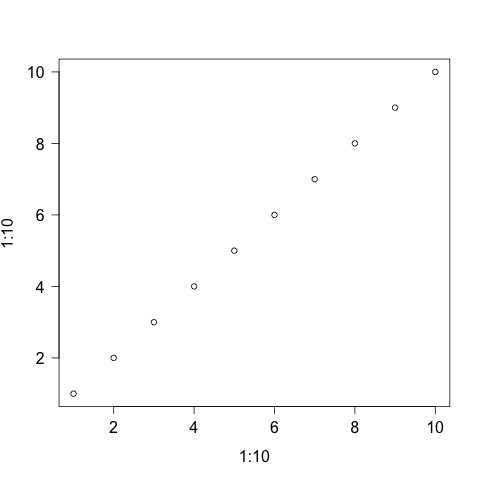
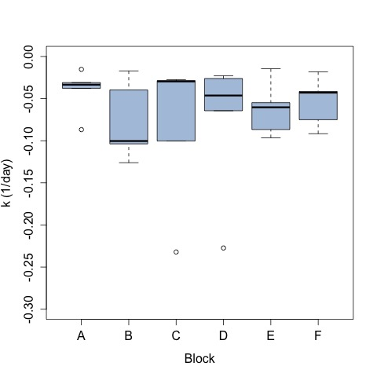
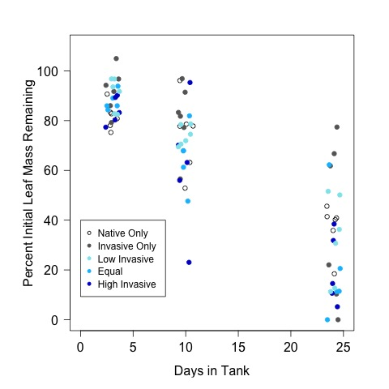
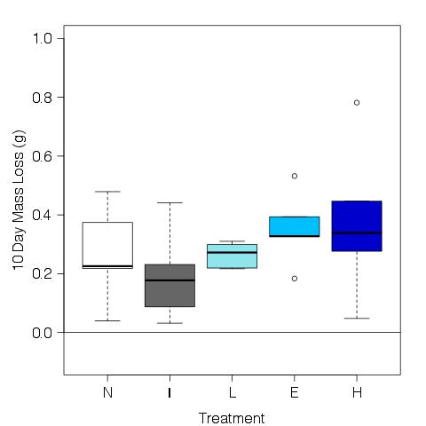

# Analysis of the leaf mass loss from the decomposition 

## Metadata

* File created on 10 June 2016 - KF

* 22 june 2016 - KF - added T2 to the analysis

* 5 July 2016 - KF - added T3 to the analysis

* 12 July 2016 - KF - remade individual time point figures for poster and altered code to fix broken variable names from leaf.AFDM data frame

* 13 July 2016 - KF - added analysis of summary stats for time points

## Description

This is the code to calculate the mass loss of the leaf packs in the experiment evaluating the impact of in invasive and native crayfish.

## R Code

### Import data

    leaf.initial <- read.table("./data/initial_leaf_mass.csv", header = T, sep = ",")
    leaf.T1 <- read.table("./data/T1_leaf_mass.csv", header = T, sep = ",")
    leaf.T2 <- read.table("./data/T2_leaf_mass.csv", header = T, sep = ",")
    leaf.T3 <- read.table("./data/T3_leaf_mass.csv", header = T, sep = ",")
    treat <- read.table("./data/tank_map.csv", header = T, sep = ",")

#### Merge treatment information

    leaf.T1 <- merge(leaf.T1, treat, by.x = "BagTank", by.y = "tank")
    leaf.T2 <- merge(leaf.T2, treat, by.x = "BagTank", by.y = "tank")
    leaf.T3 <- merge(leaf.T3, treat, by.x = "BagTank", by.y = "tank")

### Calculate variables
#### Initial AFDM

    initialDM <- leaf.initial$CrucLeafDM - leaf.initial$CrucMass
    initialAM <- leaf.initial$CrucAM - leaf.initial$CrucMas
    AFDM <- initialDM - initialAM
    leaf.initial <- data.frame(leaf.initial, AFDM)
    mean.initial.AFDM <- mean(AFDM)
    
#### T1 AFDM

    T1DM <- leaf.T1$CrucLeafDM - leaf.T1$CrucMass
    T1AM <- leaf.T1$CrucAM - leaf.T1$CrucMass
    AFDM <- T1DM - T1AM
    leaf.T1 <- data.frame(leaf.T1, AFDM)

#### T2 AFDM

    T2DM <- leaf.T2$CrucLeafDM - leaf.T2$CrucMass
    T2AM <- leaf.T2$CrucAM - leaf.T2$CrucMass
    AFDM <- T2DM - T2AM
    leaf.T2 <- data.frame(leaf.T2, AFDM)

#### T3 AFDM

    T3DM <- leaf.T3$CrucLeafDM - leaf.T3$CrucMass
    T3AM <- leaf.T3$CrucAM - leaf.T3$CrucMass
    AFDM <- T3DM - T3AM
    leaf.T3 <- data.frame(leaf.T3, AFDM)

### Analyze Mass Lost with time 

    # create a single data frame with the T1 - T3 AFDM
    leaf.AFDM <- rbind(leaf.T1, leaf.T2, leaf.T3)
    
    # convert to percent remaining in the tank
    percAFDM.rem <- (leaf.AFDM$AFDM / mean.initial.AFDM) * 100

    # calculate the time in the tank
    date <- c(as.Date(leaf.T1$Date), as.Date(leaf.T2$Date), as.Date(leaf.T3$Date)) 
    time.step <- c(rep("T1", 30), rep("T2", 30), rep("T3", 30))
    # calculate the number of days elapsed
    days.elapsed <- date - as.Date(leaf.initial$Date)[1]

    # add calc variables to data frame
    leaf.AFDM <- data.frame(leaf.AFDM, percAFDM.rem, days.elapsed)

### Calculate K for each tank
#### Create a function that calculates k for each tank

The function below, runs a linear model on the natural log of the percent leaf mass remaining by the number of days in the tank.  The function then extracts only the slope of the line and makes a data frame that matches the slope, tank number, treatment, and block.

Since two of the tanks had a percent mass remiaining of 0 on the final day, 1 was added to the percent mass remaining to avoid taking the natural log of 0.

##### Function designation
    k.tank <- function() {
     # create empty objects
     k <- numeric(0)
     tank <- numeric(0)
     treat <- character(0)
     block <- character(0)
     
     for(i in leaf.AFDM$BagTank)
       k <- c(coef(summary(lm(log(leaf.AFDM$percAFDM.rem + 1)[leaf.AFDM$BagTank == i] ~ leaf.AFDM$days.elapsed[leaf.AFDM$BagTank == i])))[2, 1], k) # this extracts the slope (col 2, row 1) from the matrix of coefficents produced by the lm
     
     for(i in leaf.AFDM$BagTank)
       tank <- c(i, tank)

     for(i in leaf.AFDM$BagTank)
       treat <- c(as.character(leaf.AFDM$treatment[leaf.AFDM$BagTank == i]), treat)
     
     for(i in leaf.AFDM$BagTank)
       block <- c(as.character(leaf.AFDM$block[leaf.AFDM$BagTank == i]), block)
     
     k.list <- data.frame(unique(tank), unique(treat), unique(block), unique(k)) # the "unique" is needed because the tank numbers are repreated for each day in the dataset so the for-loop runs 3X. The unique eliminates the duplicate data
     
     return(k.list)
    }

    k.list <- k.tank()
    names(k.list) <- c("tank", "treat", "block", "k")

#### Analyze k by treatment and block

    anova(lm(k ~ treat + block, data = k.list))
    
~~~~
ANOVA table for the combined effect of treatment and block on k

Analysis of Variance Table

Response: k
          Df   Sum Sq   Mean Sq F value Pr(>F)
treat      4 0.009090 0.0022725  0.6435 0.6378
block      5 0.006813 0.0013626  0.3859 0.8526
Residuals 20 0.070628 0.0035314   

~~~~

    anova(lm(k ~ treat, data = k.list))
    
~~~~
ANOVA table for treatment effect on k

Analysis of Variance Table

Response: k
          Df   Sum Sq   Mean Sq F value Pr(>F)
treat      4 0.009090 0.0022725  0.7336 0.5777
Residuals 25 0.077442 0.0030977    

~~~~

    plot(k ~ treat, data = k.list, ylim = c(-0.3, 0), col = "wheat", ylab = "k (1/day)", xlab = "Treatment")
    dev.copy(jpeg, "./output/plots/k_by_treat.jpg")
    dev.off()
     

K by treatment

    anova(lm(k ~ block, data = k.list))
    
~~~~
ANOVA table for effect of block on treatment

Analysis of Variance Table

Response: k
          Df   Sum Sq   Mean Sq F value Pr(>F)
block      5 0.006813 0.0013626  0.4102 0.8369
Residuals 24 0.079718 0.0033216  

~~~~

    plot(k ~ block, data = k.list, ylim = c(-0.3, 0), col = "lightsteelblue", ylab = "k (1/day)", xlab = "Block")
    dev.copy(jpeg, "./output/plots/k_by_block.jpg")
    dev.off()

k by block
     

### Summarize AFDM by Day

    tapply(leaf.AFDM$AFDM, leaf.AFDM$days.elapsed, summary)

~~~~
AFDM (g)

$`3`
Min. 1st Qu.  Median    Mean 3rd Qu.    Max. 
0.7647  0.8256  0.8734  0.8820  0.9320  1.0660 

$`10`
Min. 1st Qu.  Median    Mean 3rd Qu.    Max. 
0.2342  0.6533  0.7354  0.7288  0.7991  0.9842 

$`24`
Min. 1st Qu.  Median    Mean 3rd Qu.    Max. 
0.0000  0.1195  0.3439  0.3216  0.4584  0.7865 

~~~~
  
#### Summarize percent AFDM remaining by Day

    tapply(leaf.AFDM$percAFDM.rem, leaf.AFDM$days.elapsed, summary)

~~~~
Percent AFDM Remaining 

$`3`
Min. 1st Qu.  Median    Mean 3rd Qu.    Max. 
75.26   81.25   85.95   86.80   91.72  104.90 

$`10`
Min. 1st Qu.  Median    Mean 3rd Qu.    Max. 
23.05   64.30   72.37   71.72   78.64   96.86 

$`24`
Min. 1st Qu.  Median    Mean 3rd Qu.    Max. 
0.00   11.77   33.84   31.65   45.11   77.40 

~~~~
  
#### All treatments combined

    plot(log(percAFDM.rem) ~ days.elapsed)
    k <- lm(log(percAFDM.rem[percAFDM.rem != 0]) ~ days.elapsed[percAFDM.rem != 0])
    abline(k)

    summary(k)
~~~~
Call:
lm(formula = log(percAFDM.rem[percAFDM.rem != 0]) ~ days.elapsed[percAFDM.rem != 
    0])

Residuals:
     Min       1Q   Median       3Q      Max 
-1.70055 -0.12249  0.01296  0.22722  0.99675 

Coefficients:
                                Estimate Std. Error t value Pr(>|t|)    
(Intercept)                      4.69892    0.08032   58.50   <2e-16 ***
days.elapsed[percAFDM.rem != 0] -0.05611    0.00541  -10.37   <2e-16 ***
---

Residual standard error: 0.4389 on 86 degrees of freedom
Multiple R-squared:  0.5557, Adjusted R-squared:  0.5506 
F-statistic: 107.6 on 1 and 86 DF,  p-value: < 2.2e-16

~~~~

#### By Treatment over Time
 
    par(las = 1, mar = c(4, 5, 2, 2))
    plot(percAFDM.rem ~ jitter(as.numeric(days.elapsed), 1), data = leaf.AFDM, subset = treatment == "N", xlim = c(0, 30), ylim = c(0, 100), pch = 1, xlab = "Days in Tank", ylab = "Percent Initial Leaf Mass Remaining")
    points(percAFDM.rem ~ jitter(as.numeric(days.elapsed), 1), data = leaf.AFDM, subset = treatment == "I", pch = 19, col = "gray40")
    points(percAFDM.rem ~ jitter(as.numeric(days.elapsed), 1), data = leaf.AFDM, subset = treatment == "E", pch = 19, col = "deepskyblue")
    points(percAFDM.rem ~ jitter(as.numeric(days.elapsed), 1), data = leaf.AFDM, subset = treatment == "H", pch = 19, col = "blue3")
    points(percAFDM.rem ~ jitter(as.numeric(days.elapsed), 1), data = leaf.AFDM, subset = treatment == "L", pch = 19, col = "cadetblue2")
    legend(0, 40, c("Native Only  ", "Invasive Only  ", "Low Invasive  ", "Equal  ", "High Invasive  "), pch = c(1, 19, 19, 19, 19, 19), col = c(1, "gray40", "cadetblue2", "deepskyblue", "blue3"), cex = 0.9)
    dev.copy(jpeg, "./output/plots/percMassRem_by_treat_days.jpg")
    dev.off()

### Mass Lost per Time Step

    ordered.treat <- factor(treat$treatment, levels = c("N", "I", "L", "E", "H"))

    mass.lost.T1 <- mean.initial.AFDM - leaf.AFDM$AFDM[leaf.AFDM$Date == "2016-06-06"]
    par(las = 1, mar = c(4, 5, 2, 2))
    plot(mass.lost.T1 ~ ordered.treat, ylab = "3 Day Mass Loss (g)", xlab = "Treatment", col = c("white", "gray40", "cadetblue2", "deepskyblue", "blue3"), ylim = c(-0.1, 1))
    abline(h = 0)
    dev.copy(jpeg, "./output/plots/T0_T1_mass_loss.jpg")
    dev.off()

    mass.lost.T2 <- mean.initial.AFDM - leaf.AFDM$AFDM[leaf.AFDM$Date == "2016-06-13"]
    par(las = 1, mar = c(4, 5, 2, 2))
    plot(mass.lost.T2 ~ ordered.treat, ylab = "10 Day Mass Loss (g)", xlab = "Treatment", col = c("white", "gray40", "cadetblue2", "deepskyblue", "blue3"), ylim = c(-0.1, 1))
    abline(h = 0)
    dev.copy(jpeg, "./output/plots/T0_T2_mass_loss.jpg")
    dev.off()

    mass.lost.T3 <- mean.initial.AFDM - leaf.AFDM$AFDM[leaf.AFDM$Date == "2016-06-27"]
    par(las = 1, mar = c(4, 5, 2, 2))
    plot(mass.lost.T3 ~ ordered.treat, ylab = "24 Day Mass Loss (g)", xlab = "Treatment", col = c("white", "gray40", "cadetblue2", "deepskyblue", "blue3"), ylim = c(-0.1, 1))
    abline(h = 0)
    dev.copy(jpeg, "./output/plots/T0_T3_mass_loss.jpg")
    dev.off()

    
### Plot by Tank

    plot(percAFDM.rem ~ BagTank, data = leaf.AFDM, subset = days.elapsed == "3", pch = 19, col = 1, ylim = c(0, 110) )
    points(percAFDM.rem ~ BagTank, data = leaf.AFDM, subset = days.elapsed == "10", pch = 19, col = 2, ylim = c(0, 110) )
    points(percAFDM.rem ~ BagTank, data = leaf.AFDM, subset = days.elapsed == "24", pch = 19, col = 3, ylim = c(0, 110) )

