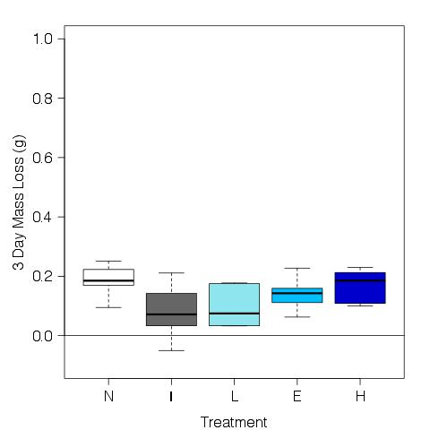

# Analysis of the leaf mass loss from the decomposition 

## Metadata

* File created on 10 June 2016 - KF

* 22 june 2016 - KF - added T2 to the analysis

## Description

This is the code to calculate the mass loss of the leaf packs in the experiment evaluating the impact of in invasive and native crayfish.

## R Code

### Import data

    leaf.initial <- read.table("./data/initial_leaf_mass.csv", header = T, sep = ",")
    leaf.T1 <- read.table("./data/T1_leaf_mass.csv", header = T, sep = ",")
    leaf.T2 <- read.table("./data/T2_leaf_mass.csv", header = T, sep = ",")
    treat <- read.table("./data/tank_map.csv", header = T, sep = ",")

### Calculate variables
#### Initial AFDM

    initialDM <- leaf.initial$CrucLeafDM - leaf.initial$CrucMass
    initialAM <- leaf.initial$CrucAM - leaf.initial$CrucMas
    initialAFDM <- initialDM - initialAM
    mean.initial.AFDM <- mean(initialAFDM)
    
#### T1 AFDM

    T1DM <- leaf.T1$CrucLeafDM - leaf.T1$CrucMass
    T1AM <- leaf.T1$CrucAM - leaf.T1$CrucMass
    T1AFDM <- T1DM - T1AM

#### T2 AFDM

    T2DM <- leaf.T2$CrucLeafDM - leaf.T2$CrucMass
    T2AM <- leaf.T2$CrucAM - leaf.T2$CrucMass
    T2AFDM <- T2DM - T2AM

### Analyze Mass Lost

    leaf.mass <- c(initialAFDM, T1AFDM, T2AFDM)
    date <- c(as.Date(leaf.initial$Date), as.Date(leaf.T1$Date), as.Date(leaf.T2$Date)) 
    time.step <- c(rep("T0", 11), rep("T1", 30), rep("T2", 30))
    days.elapsed <- date - date[1]
    plot(log(leaf.mass) ~ days.elapsed) 
    k <- lm(log(leaf.mass) ~ days.elapsed)
    abline(k)
    
~~~~~
  Call:
  lm(formula = log(leaf.mass) ~ days.elapsed)

Residuals:
  Min       1Q   Median       3Q      Max 
-1.10138 -0.05996  0.01447  0.09553  0.33428 

Coefficients:
  Estimate Std. Error t value Pr(>|t|)    
(Intercept)  -0.013507   0.037563  -0.360     0.72    
days.elapsed -0.033670   0.005535  -6.083 5.83e-08 

Residual standard error: 0.1859 on 69 degrees of freedom
Multiple R-squared: 0.3491,  Adjusted R-squared: 0.3396 
F-statistic:    37 on 1 and 69 DF,  p-value: 5.826e-08 

~~~~

    mass.lost.T1 <- mean.initial.AFDM - T1AFDM
    par(las = 1)
    plot(mass.lost.T1 ~ treat$treatment, ylab = "T0 - T1 Mass Loss (g)", xlab = "Treatment", col = 8)
    abline(h = 0)
    dev.copy(jpeg, "./output/plots/T0_T1_mass_loss.jpg")
    dev.off()

    mass.lost.T2 <- mean.initial.AFDM - T2AFDM
    par(las = 1)
    plot(mass.lost.T2 ~ treat$treatment, ylim = c(0, 1), ylab = "T0 - T1 Mass Loss (g)", xlab = "Treatment", col = 8)
    dev.copy(jpeg, "./output/plots/T0_T2_mass_loss.jpg")
    dev.off()

