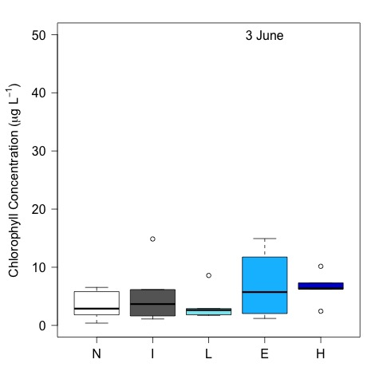
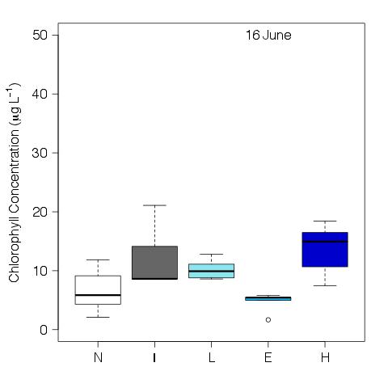

# Analysis of the tank chl

## Metadata

* File created on 6 July 2016

* modified 7 July 2016 - KF - added final CHL to the analysis

* modified 12 July 2016 - KF - added figures to report

* modified 13 Jul 2016 - KF - sumarized chl by day

## Description

This is the code to analyze the effect of crayfish community on the tank chlorophyll the experiment evaluating the impact of in invasive and native crayfish.

## R Code

### Import data

    ysi <- read.table("./data/tank_YSI.csv", header = T, sep = ",")
    chl <- read.table("./data/tank_chl.csv", header = T, sep = ",")
    treat <- read.table("./data/tank_map.csv", header = T, sep = ",")

### Merge tank map with chem data

    chl <- merge(chl, treat, by = "tank")

Three of the chl measurement read below 0, I removed these values from the analysis with the code below

    chl.trunk <- chl
    chl.trunk$Chl[chl.trunk$Chl < 0 ] <- NA

#### Create days.elapsed

     days.elapsed <- as.numeric(as.Date(chl.trunk$Date) - as.Date("2016-06-03"))

### Summarize Chl by Day

    tapply(chl.trunk$Chl, chl.trunk$Date, summary)

~~~~
  
$`2016-06-03`
Min. 1st Qu.  Median    Mean 3rd Qu.    Max.    NAs 
  0.240   1.830   3.300   4.781   6.540  14.930       1 

$`2016-06-16`
   Min. 1st Qu.  Median    Mean 3rd Qu.    Max.    NAs 
1.670   5.698   8.700   9.552  12.070  21.090       2 

$`2016-06-30`
Min. 1st Qu.  Median    Mean 3rd Qu.    Max. 
8.42   14.70   19.46   21.29   27.06   47.89 

~~~~

### Analyze Chl by treatment
#### Repeated measures ANCOVA

The `lmerTest` package is required

    (chl.mod <- lmer(Chl ~ 1 + days.elapsed * treatment + block + (1|tank), data = chl.trunk))

    anova(chl.mod)

### Plots by Time Step

#### create factor list in correct order

    ordered.treat <- factor(chl.trunk$treatment, levels = c("N", "I", "L", "E", "H"))

#### Plots

    par(las = 1, mar = c(4, 5, 2, 2))
    plot(Chl ~ ordered.treat, data = chl.trunk, subset = Date == "2016-06-03", ylim = c(0, 50), ylab = expression(paste("Chlorophyll Concentration (", mu, "g L"^{-1}, ")")), xlab = " ", col = c("white", "gray40", "cadetblue2", "deepskyblue", "blue3"))
    text(4, 50, "3 June")
    dev.copy(jpeg, "./output/plots/chl_treat_T0.jpg")
    dev.off()

    par(las = 1, mar = c(4, 5, 2, 2))
    plot(Chl ~ ordered.treat, data = chl.trunk, subset = Date == "2016-06-16", ylim = c(0, 50), ylab = expression(paste("Chlorophyll Concentration (", mu, "g L"^{-1}, ")")), xlab = " ", col = c("white", "gray40", "cadetblue2", "deepskyblue", "blue3"))
    text(4, 50, "16 June")
    dev.copy(jpeg, "./output/plots/chl_treat_T1.jpg")
    dev.off()

    par(las = 1, mar = c(4, 5, 2, 2))
    plot(Chl ~ ordered.treat, data = chl.trunk, subset = Date == "2016-06-30", ylim = c(0, 50), ylab = expression(paste("Chlorophyll Concentration (", mu, "g L"^{-1}, ")")), xlab = " ", col = c("white", "gray40", "cadetblue2", "deepskyblue", "blue3"))
    text(4, 50, "30 June")
    dev.copy(jpeg, "./output/plots/chl_treat_T2.jpg")
    dev.off()

    anova(lm(Chl ~ treatment * Date, data = chl))

    
