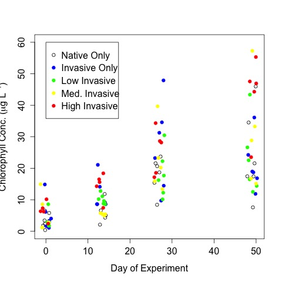
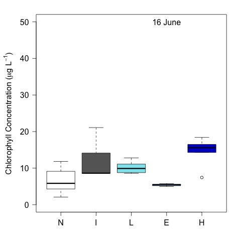

# Analysis of the tank chl

## Metadata

* File created on 6 July 2016

* modified 7 July 2016 - KF - added final CHL to the analysis

* modified 12 July 2016 - KF - added figures to report

* modified 13 Jul 2016 - KF - sumarized chl by day

* modified 13 Dec 2016 - KF - coded ANCOVA on chl by treatment

* modified 15 May 2017 - KF- removed tanks 3 and 4 and re-ran analysis

## Description

This is the code to analyze the effect of crayfish community on the tank chlorophyll the experiment evaluating the impact of in invasive and native crayfish.

## R Code
### Load Packages

The `lmerTest` package is required

    library("lmerTest")

### Import data

    ysi <- read.table("./data/tank_YSI.csv", header = T, sep = ",")
    chl <- read.table("./data/tank_chl.csv", header = T, sep = ",")
    treat <- read.table("./data/tank_map.csv", header = T, sep = ",")

### Merge tank map with chem data

    chl <- merge(chl, treat, by = "tank")

### Modify data to remove negative numbers and tanks with bad treatments

Three of the chl measurement read below 0, I removed these values from the analysis with the code below

    chl.trunk <- chl
    chl.trunk$Chl[chl.trunk$Chl < 0 ] <- NA

Tanks 3 and 4 accidentally had O. longulus added to them rather than O. virilus.  These tanks were removed from the analysis

    chl.trunk <- chl.trunk[chl.trunk$tank != 3 & chl.trunk$tank != 4,]
    
#### Create days.elapsed

     days.elapsed <- as.numeric(as.Date(chl.trunk$Date) - as.Date("2016-06-03"))

### Summarize Chl by Day

    tapply(chl.trunk$Chl, chl.trunk$Date, summary)
    tapply(chl.trunk$Chl, chl.trunk$Date, sd, na.rm = T)

    ##################################################
    $`2016-06-03`
    Min.    1st Qu.  Median    Mean    3rd Qu.    Max.     SD            NAs 
    0.390   2.085    3.300     4.882   6.445      14.930   3.893177      1 

    $`2016-06-16`
    Min. 1st Qu.  Median    Mean 3rd Qu.    Max.    SD             NAs 
    2.110   5.992   8.700   9.812  12.540  21.090    4.669907       2 

    $`2016-06-30
    Min. 1st Qu.  Median    Mean 3rd Qu.    Max.    SD
    8.42   15.77   20.44   22.07   28.30   47.89    9.476181  

    $`2016-07-22`
    Min. 1st Qu.  Median    Mean 3rd Qu.    Max.    SD
    7.59   16.81   23.03   27.72   37.92   57.28    14.211278

    ##################################################

### Analyze Chl by treatment
#### Repeated measures ANCOVA

I ln-transformed the chl values to correct for non-homogeneity of variance determined by a funnel shape in the resid vs fitted plot of the untransformed data.

I did not analyze block because the blocks were not properly set up for the present env. gradients. 

##### Set up Mixed Linear Model of chl as a function of days and treatment with tank as the random variable

    (chl.mod <- lmer(log(Chl) ~ 1 + days.elapsed * treatment + (1|tank), data = chl.trunk))

    ##################################################
    # Linear Mixed Model parameters of Chl as a function of days and treatment with tank as the random variable

    Linear mixed model fit by REML ['merModLmerTest']
    Formula: log(Chl) ~ 1 + days.elapsed * treatment + (1 | tank)
    Data: chl.trunk
    REML criterion at convergence: 252.1155
    Random effects:
    Groups   Name        Std.Dev.
    tank     (Intercept) 0.1748  
    Residual             0.6195  
    Number of obs: 109, groups:  tank, 28
    Fixed Effects:
            (Intercept)             days.elapsed               treatmentH  
              1.5204080                0.0396717                0.4479131  
             treatmentI               treatmentL               treatmentN  
              0.1721757               -0.0536818               -0.3825347  
days.elapsed:treatmentH  days.elapsed:treatmentI  days.elapsed:treatmentL  
             -0.0007786               -0.0057770               -0.0019806  
days.elapsed:treatmentN  
              0.0047562  
              
~~~~

Test of factor significants 
 
    anova(chl.mod)

~~~~
ANCOVA of chl by days elapsed, and treatment

Analysis of Variance Table of type III  with  Satterthwaite 
approximation for degrees of freedom
                       Sum Sq Mean Sq NumDF  DenDF F.value Pr(>F)    
days.elapsed           54.011  54.011     1 76.158 140.733 <2e-16 ***
treatment               2.915   0.729     4 75.447   1.899 0.1194    
days.elapsed:treatment  0.453   0.113     4 76.078   0.295 0.8804

~~~~
 
### Plot by Days
 
    plot(Chl ~ jitter(days.elapsed, 0.5), data = chl.trunk, subset = treatment == "N", pch = 1, col = "black", ylim = c(0, 60), xlab = "Day of Experiment", ylab = expression(paste("Chlorophyll Conc. (", mu, "g L"^{-1}, ")")))
    points(Chl ~  jitter(days.elapsed, 0.5), data = chl.trunk, subset = treatment == "I", pch = 19, col = "blue")
    points(Chl ~ jitter(days.elapsed, 0.5), data = chl.trunk, subset = treatment == "L", pch = 19, col = "green")
    points(Chl ~ jitter(days.elapsed, 0.5), data = chl.trunk, subset = treatment == "E", pch = 19, col = "yellow")
    points(Chl ~ jitter(days.elapsed, 0.5), data = chl.trunk, subset = treatment == "H", pch = 19, col = "red")
    legend(0, 60, c("Native Only", "Invasive Only", "Low Invasive", "Med. Invasive", "High Invasive"), pch = c(1, 19, 19, 19, 19), col = c("black", "blue", "green", "yellow", "red")) 
    dev.copy(jpeg, "./output/chl_by_day.jpg")
    dev.off()

### Plots by Time Step

#### create factor list in correct order

    ordered.treat <- factor(chl.trunk$treatment, levels = c("N", "I", "L", "E", "H"))

#### Plots

    par(las = 1, mar = c(4, 5, 2, 2))
    plot(Chl ~ ordered.treat, data = chl.trunk, subset = Date == "2016-06-03", ylim = c(0, 50), ylab = expression(paste("Chlorophyll Concentration (", mu, "g L"^{-1}, ")")), xlab = " ", col = c("white", "gray40", "cadetblue2", "deepskyblue", "blue3"))
    text(4, 50, "3 June")
    dev.copy(jpeg, "./output/plots/chl_treat_T0.jpg")
    dev.off()

    par(las = 1, mar = c(4, 5, 2, 2))
    plot(Chl ~ ordered.treat, data = chl.trunk, subset = Date == "2016-06-16", ylim = c(0, 50), ylab = expression(paste("Chlorophyll Concentration (", mu, "g L"^{-1}, ")")), xlab = " ", col = c("white", "gray40", "cadetblue2", "deepskyblue", "blue3"))
    text(4, 50, "16 June")
    dev.copy(jpeg, "./output/plots/chl_treat_T1.jpg")
    dev.off()

    par(las = 1, mar = c(4, 5, 2, 2))
    plot(Chl ~ ordered.treat, data = chl.trunk, subset = Date == "2016-06-30", ylim = c(0, 50), ylab = expression(paste("Chlorophyll Concentration (", mu, "g L"^{-1}, ")")), xlab = " ", col = c("white", "gray40", "cadetblue2", "deepskyblue", "blue3"))
    text(4, 50, "30 June")
    dev.copy(jpeg, "./output/plots/chl_treat_T2.jpg")
    dev.off()

    
