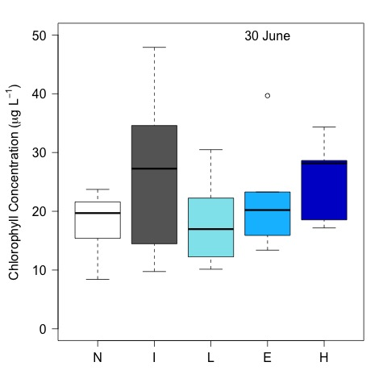

# Analysis of the tank chl

## Metadata

* File created on 6 July 2016

* modified 7 July 2016 - KF - added final CHL to the analysis

* modified 12 July 2016 - KF - added figures to report

* modified 13 Jul 2016 - KF - sumarized chl by day

* modified 13 Dec 2016 - KF - coded ANCOVA on chl by treatment

## Description

This is the code to analyze the effect of crayfish community on the tank chlorophyll the experiment evaluating the impact of in invasive and native crayfish.

## R Code

### Import data

    ysi <- read.table("./data/tank_YSI.csv", header = T, sep = ",")
    chl <- read.table("./data/tank_chl.csv", header = T, sep = ",")
    treat <- read.table("./data/tank_map.csv", header = T, sep = ",")

### Merge tank map with chem data

    chl <- merge(chl, treat, by = "tank")

Three of the chl measurement read below 0, I removed these values from the analysis with the code below

    chl.trunk <- chl
    chl.trunk$Chl[chl.trunk$Chl < 0 ] <- NA

#### Create days.elapsed

     days.elapsed <- as.numeric(as.Date(chl.trunk$Date) - as.Date("2016-06-03"))

### Summarize Chl by Day

    tapply(chl.trunk$Chl, chl.trunk$Date, summary)
    tapply(chl.trunk$Chl, chl.trunk$Date, sd, na.rm = T)

~~~~
$`2016-06-03`
   Min. 1st Qu.  Median    Mean 3rd Qu.    Max.    NAs   SD
  0.240   1.830   3.300   4.781   6.540  14.930       1  3.864727

$`2016-06-16`
   Min. 1st Qu.  Median    Mean 3rd Qu.    Max.    NAs   SD
  1.670   5.698   8.700   9.552  12.070  21.090       2  4.754465

$`2016-06-30`
   Min. 1st Qu.  Median    Mean 3rd Qu.    Max.  SD
   8.42   14.70   19.46   21.29   27.06   47.89  9.613351

$`2016-07-22`
   Min. 1st Qu.  Median    Mean 3rd Qu.    Max.  SD
   7.59   16.98   23.89   27.89   35.72   57.28  13.729199

~~~~

### Analyze Chl by treatment
#### Repeated measures ANCOVA

The `lmerTest` package is required

    (chl.mod <- lmer(Chl ~ 1 + days.elapsed * treatment + block + (1|tank), data = chl.trunk))

~~~~
lmer output for above model

Linear mixed model fit by REML ['merModLmerTest']
Formula: Chl ~ 1 + days.elapsed * treatment + block + (1 | tank)
   Data: chl.trunk
REML criterion at convergence: 796.0719
Random effects:
 Groups   Name        Std.Dev.
 tank     (Intercept) 1.455   
 Residual             8.260   
Number of obs: 117, groups:  tank, 30
Fixed Effects:
            (Intercept)             days.elapsed               treatmentH  
                -1.8220                   0.5633                   2.5248  
             treatmentI               treatmentL               treatmentN  
                 5.8390                   2.0594                   0.2706  
                 blockB                   blockC                   blockD  
                 5.4610                   2.8582                   5.6476  
                 blockE                   blockF  days.elapsed:treatmentH  
                 8.2260                   5.0450                   0.1534  
days.elapsed:treatmentI  days.elapsed:treatmentL  days.elapsed:treatmentN  
                -0.2118                  -0.1668                  -0.1124 

~~~~

Test of factor significants 
 
    anova(chl.mod)

~~~~
ANCOVA of chl by days elapsed, treatment, and block

NOTE: the interaction between treatment and block could not be analyzed because it produces singlarities.

Analysis of Variance Table of type III  with  Satterthwaite 
approximation for degrees of freedom
                       Sum Sq Mean Sq NumDF  DenDF F.value  Pr(>F)    
days.elapsed           9527.1  9527.1     1 82.321 139.634 < 2e-16 ***
treatment               188.2    47.0     4 75.694   0.690 0.60144    
block                   696.6   139.3     5 19.543   2.042 0.11710    
days.elapsed:treatment  675.9   169.0     4 82.269   2.476 0.05046 .  

~~~~
 
### Plot by Days
 
    plot(Chl ~ jitter(days.elapsed, 0.5), data = chl.trunk, subset = treatment == "N", pch = 1, col = "black", ylim = c(0, 60), xlab = "Day of Experiment", ylab = expression(paste("Chlorophyll Conc. (", mu, "g L"^{-1}, ")")))
    points(Chl ~  jitter(days.elapsed, 0.5), data = chl.trunk, subset = treatment == "I", pch = 19, col = "blue")
    points(Chl ~ jitter(days.elapsed, 0.5), data = chl.trunk, subset = treatment == "L", pch = 19, col = "green")
    points(Chl ~ jitter(days.elapsed, 0.5), data = chl.trunk, subset = treatment == "E", pch = 19, col = "yellow")
    points(Chl ~ jitter(days.elapsed, 0.5), data = chl.trunk, subset = treatment == "H", pch = 19, col = "red")
    legend(0, 60, c("Native Only", "Invasive Only", "Low Invasive", "Med. Invasive", "High Invasive"), pch = c(1, 19, 19, 19, 19), col = c("black", "blue", "green", "yellow", "red")) 
    dev.copy(jpeg, "./output/chl_by_day.jpg")
    dev.off()

### Plots by Time Step

#### create factor list in correct order

    ordered.treat <- factor(chl.trunk$treatment, levels = c("N", "I", "L", "E", "H"))

#### Plots

    par(las = 1, mar = c(4, 5, 2, 2))
    plot(Chl ~ ordered.treat, data = chl.trunk, subset = Date == "2016-06-03", ylim = c(0, 50), ylab = expression(paste("Chlorophyll Concentration (", mu, "g L"^{-1}, ")")), xlab = " ", col = c("white", "gray40", "cadetblue2", "deepskyblue", "blue3"))
    text(4, 50, "3 June")
    dev.copy(jpeg, "./output/plots/chl_treat_T0.jpg")
    dev.off()

    par(las = 1, mar = c(4, 5, 2, 2))
    plot(Chl ~ ordered.treat, data = chl.trunk, subset = Date == "2016-06-16", ylim = c(0, 50), ylab = expression(paste("Chlorophyll Concentration (", mu, "g L"^{-1}, ")")), xlab = " ", col = c("white", "gray40", "cadetblue2", "deepskyblue", "blue3"))
    text(4, 50, "16 June")
    dev.copy(jpeg, "./output/plots/chl_treat_T1.jpg")
    dev.off()

    par(las = 1, mar = c(4, 5, 2, 2))
    plot(Chl ~ ordered.treat, data = chl.trunk, subset = Date == "2016-06-30", ylim = c(0, 50), ylab = expression(paste("Chlorophyll Concentration (", mu, "g L"^{-1}, ")")), xlab = " ", col = c("white", "gray40", "cadetblue2", "deepskyblue", "blue3"))
    text(4, 50, "30 June")
    dev.copy(jpeg, "./output/plots/chl_treat_T2.jpg")
    dev.off()

    
